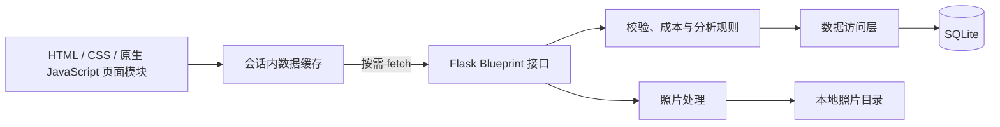
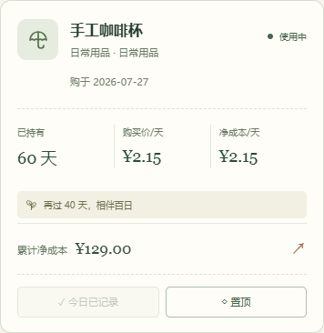
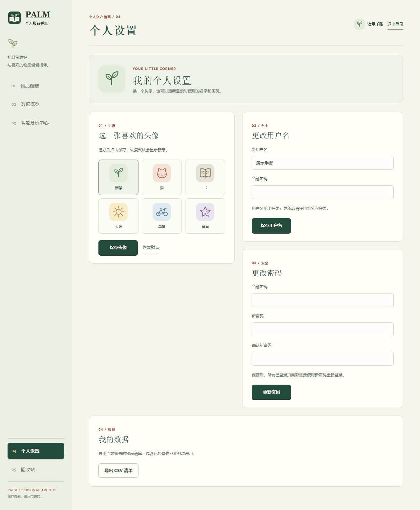
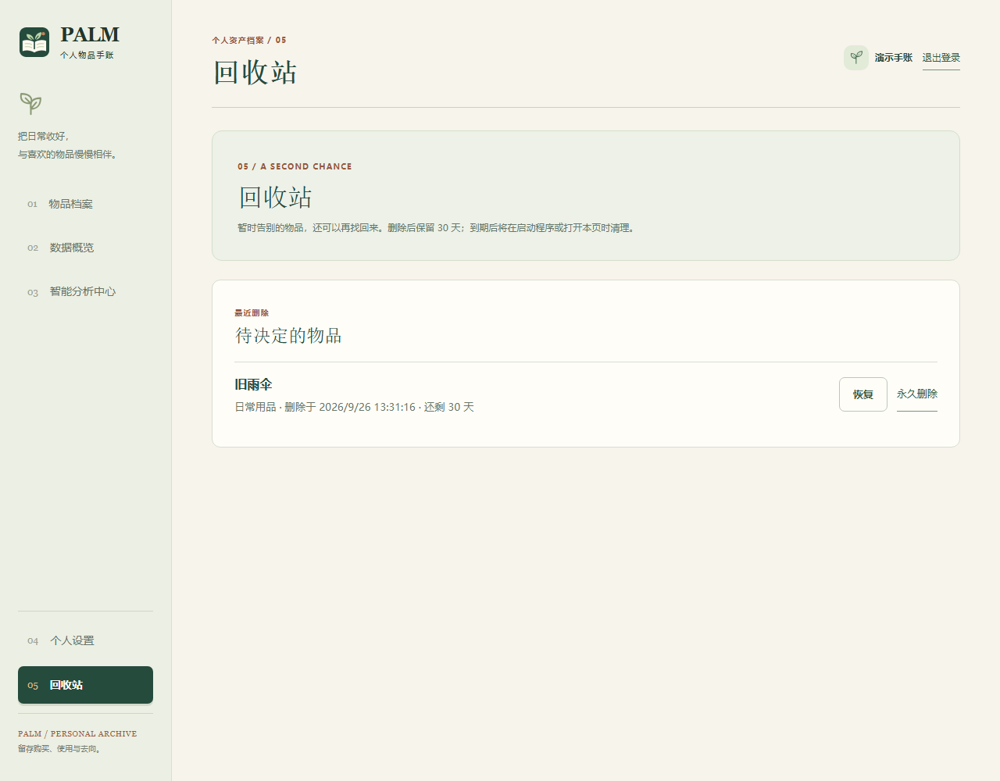
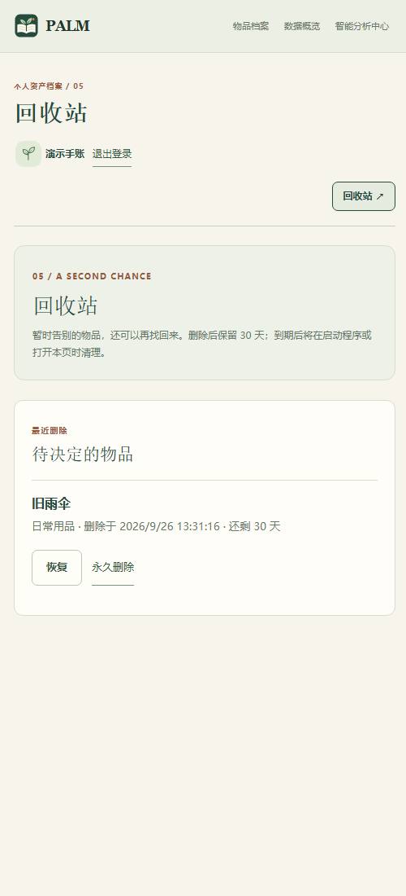
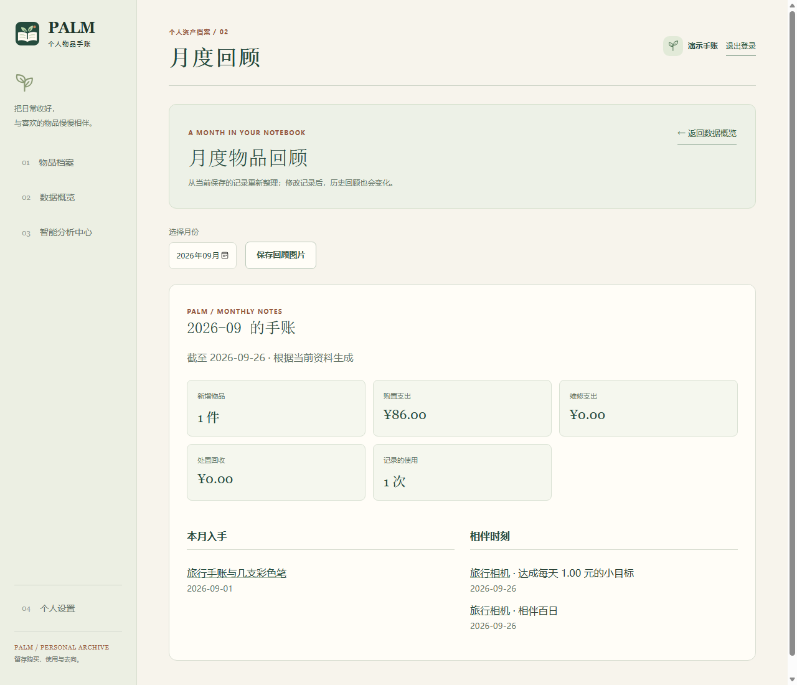
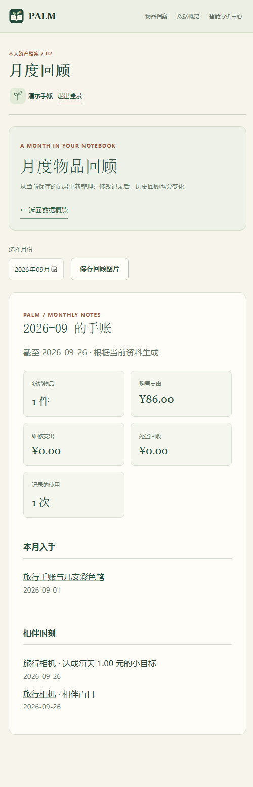
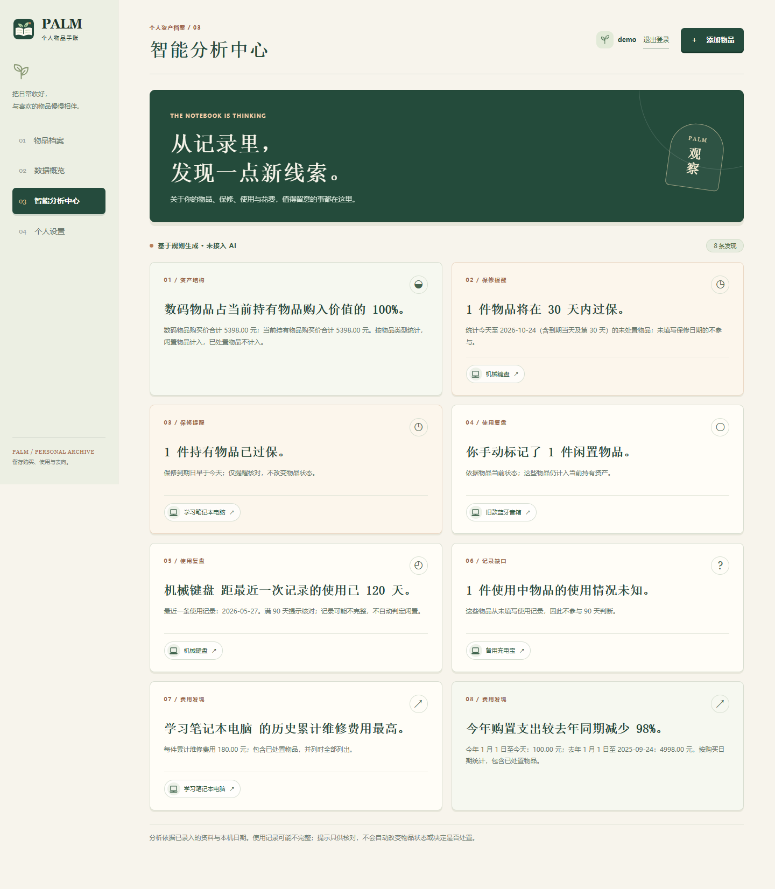
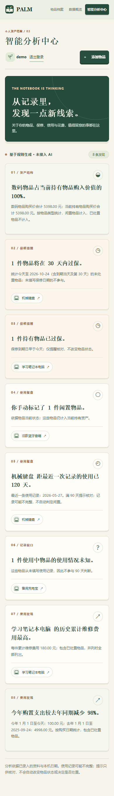

# PALM：个人物品资产生命周期管理平台


本地运行的多用户网页系统，以“个人物品手账”的形式记录物品从购买、使用、维修、闲置到处置的过程，并统计资产结构、使用成本，留下相伴纪念章与日均花费目标。不同账号的物品与统计相互隔离。前端使用 HTML、CSS、原生 JavaScript；后端使用 Python Flask；数据保存在 SQLite。

## 项目架构



`app.py` 是本地启动入口，也保留 `create_app` 的导入方式。`palm` 包按职责组织后端：应用工厂与统一请求保护在 `__init__.py`、`security.py`；数据库连接及版本 8 升级在 `database.py`、`schema.py`；账号、页面、物品、生命周期记录、统计、回收站、CSV 导出及月度回顾使用各自的 `routes_*.py`；SQL 集中在 `repository.py`，回收站和月度回顾规则分别在 `trash.py`、`reports.py`。纪念章与日均目标计算仍在独立的 `journey.py`。

导入 `app` 或调用 `create_app()` 只配置应用，不创建数据库或密钥。`python app.py` 会显式调用 `initialize_app()`，生成或读取会话密钥、备份需要升级的旧数据库并完成初始化，然后启动服务。程序保留已有备份文件名，升级语句在事务中执行；升级失败会停止启动并回滚尚未提交的变更。旧数据和照片目录沿用原位置。

物品列表一次批量读取各物品的维修合计、使用次数、最近使用日期、今日记录和处置结果；统计与智能分析复用这些汇总值。使用与维修分别汇总后再关联物品，避免多条记录相互放大金额或次数。金额仍按整数分计算，接口地址及返回格式保持不变。

前端使用浏览器原生 ES Modules，不需要打包工具。`static/app.js` 负责登录初始化、导航和操作协调；`static/js/` 内的 `api.mjs` 处理请求与会话错误，`data-store.mjs` 管理会话内读取缓存，`navigation.mjs` 处理地址片段，`items.mjs`、`detail.mjs`、`dashboard.mjs`、`analysis.mjs`、`account.mjs`、`report.mjs` 分别渲染页面。`forms.mjs` 管理录入与照片预览，`common.mjs`、`feedback.mjs` 提供公共展示与提示。

公共配色、按钮和基础组件在 `static/style.css`；登录前首页、认证页和登录后页面通过模板加载各自的布局与手账样式，公共响应式规则在 `style-responsive.css`、`notebook-responsive.css` 中。保留原有 HTML、CSS、原生 JavaScript 与页面外观。

## 启动

需要 Python 3.10 或更新版本。Windows 用户可双击项目根目录的 **[启动 PALM.bat](<启动 PALM.bat>)**。脚本会打开终端并显示访问地址 <http://127.0.0.1:5000>；首次运行会自动创建 `.venv` 并安装 `requirements.txt` 中的依赖，因此需要联网。之后启动会检查并补全缺失的依赖。浏览器需手动打开该地址；关闭终端窗口或按 `Ctrl+C` 即可停止服务。若 Python 缺失、依赖安装失败或 5000 端口被占用，终端会保留错误提示。

也可以在项目目录使用以下命令启动（Windows PowerShell）：

```powershell
python -m venv .venv
.venv\Scripts\python.exe -m pip install -r requirements.txt
.venv\Scripts\python.exe app.py
```

浏览器打开 <http://127.0.0.1:5000>，先看到介绍页，点击“登录”或“注册”进入对应表单，再开始记录。首次启动会自动创建数据库 `instance/palm.sqlite3` 和会话密钥 `instance/session.key`。停止服务后再次启动，账号和数据会保留；备份或迁移到另一台电脑时应同时保留数据库、密钥和物品照片目录 `instance/uploads/items`。系统只监听本机地址。

从旧版升级时，程序会在改动数据库前自动保存 `instance/palm.sqlite3.pre-accounts.bak`。**首位成功注册的用户将接收旧数据库中全部物品及其记录**，其他新用户从空档案开始。请由原数据的拥有者先注册；备份文件不会在后续启动时被覆盖。升级前先停止旧版服务，重要数据建议另存一份备份。

升级到物品类型图标版本时，程序会另存 `instance/palm.sqlite3.pre-icons.bak`，再给旧物品补充类型：`数码设备` → 数码、`日常用品` → 日常用品、`出行用品` → 出行，其他分类 → 其他。可在编辑物品时调整。已有分类、账号归属和费用记录不会改变。

升级到纪念日与目标版本时，程序会先保存 `instance/palm.sqlite3.pre-goals.bak`，再添加可为空的 `daily_target_cents` 字段（整数分），数据库版本升至 4。旧物品默认没有目标；纪念章根据原购买日期自动计算。重复启动不会覆盖备份或重置已设目标。上述备份只在对应字段缺失时生成，已有最新版数据库不再重复备份。

升级到个人设置版本时，程序会先保存 `instance/palm.sqlite3.pre-profile.bak`，再给用户表添加头像与登录状态版本字段，数据库版本升至 5。旧账号默认显示新芽头像，用户名、密码及物品归属保持不变；备份不会被后续启动覆盖。修改密码会让该账号此前的登录状态失效。

升级到智能分析中心版本时，程序会先保存 `instance/palm.sqlite3.pre-warranty.bak`，再给物品表添加可为空的保修到期日，数据库版本升至 6。旧物品默认没有保修日期；分类、账号归属、费用和生命周期记录不变。备份只在缺少该字段时创建，重复启动不会覆盖。

升级到照片与置顶版本时，程序会先保存 `instance/palm.sqlite3.pre-photos-pins.bak`，再添加照片引用和置顶字段，数据库版本升至 7。旧物品没有照片，默认不置顶；原有物品与记录不变。此数据库备份不包含照片文件，今后备份或迁移请同时复制 `instance/uploads/items`。照片目录首次上传时自动创建，重复启动不会覆盖迁移备份。

升级到回收站版本时，程序会先保存 `instance/palm.sqlite3.pre-trash.bak`，再为物品添加删除时间，数据库版本升至 8。已有物品默认未删除；备份不会因重复启动而覆盖。数据库备份不包含照片，升级或迁移时请同时保留 `instance/uploads/items`。启动时会清理已超过 30 天的回收站物品。

如需演示数据，先在页面注册一个账号，然后在**该账号没有物品**时运行：

```powershell
.venv\Scripts\python.exe seed_demo.py
```

脚本会提示输入已注册的用户名及密码（密码输入时不回显），仅向该账号导入。演示数据包含已达成花费目标且已过保的笔记本电脑、闲置音箱、目标未达成便出售的自行车、丢弃的雨伞、将在 20 天后过保且超过 90 天未记录使用的键盘，以及当天相伴百日并达成目标的充电宝。所选账号已有物品时不会写入，以免混入真实数据。

## 页面入口与外观

| 页面 | 地址与行为 |
| --- | --- |
| 介绍页 | 未登录访问 `/`；展示功能、示例档案和可拖动的键盘日均花费体验。固定示例不会写入数据库，也不读取个人物品 |
| 登录、注册 | `/login`、`/register`；可互相切换或返回介绍页；成功后进入物品档案 |
| 我的档案 | `/app#/items`；默认物品清单，支持数据概览、月度回顾、智能分析中心、详情与个人设置；未登录时转到登录页 |
| 回收站 | `/app#/trash`；桌面侧栏底部和手机页面顶部均有入口，可恢复或永久删除当前账号的物品 |

已登录访问 `/`、`/login`、`/register` 会进入 `/app`。退出登录后回到介绍页，可重新登录其他账号；登录失效会提示重新登录。认证与业务页面不缓存账号内容，恢复浏览器历史页面时会重新检查登录。

登录后按地址打开对应页面；默认只读取物品清单。数据概览、智能分析、回收站和月度回顾在进入时分别读取需要的数据。读取结果在当前登录会话内最多复用 60 秒，相同的并发读取会合并。修改记录后立即更新当前页面，其他相关页面在下次进入时刷新；页面重新获得焦点或跨日时刷新当前内容。缓存不会写入浏览器持久存储，退出或切换账号时清空。加载失败会显示原因与“重新加载”；慢请求的旧结果不会覆盖后来打开的页面。

地址片段记录页面、物品详情，以及清单搜索、状态、分类和排序；例如 `/app#/items?q=相机`、`/app#/items/3`。旧链接中的 `type` 筛选参数会忽略并从地址中清除。浏览器前进、后退和刷新可恢复页面；从详情返回清单时恢复筛选与滚动位置。搜索输入更新当前历史记录，切换筛选可用浏览器后退。换账号后不会显示上一个账号的缓存；无权访问的详情会提示并返回清单；临时读取失败则保留详情地址以供重试。

页面使用暖白、墨绿和淡彩标签，桌面物品卡片双列、窄屏单列；录入、详情、统计、个人设置及认证页面使用同一套风格。品牌 Logo 是“手账与新芽”的本地 SVG，统一用于导航、登录页、加载画面、介绍页及浏览器标签；其他插画和图标也是本地 SVG。字体采用系统字体；动画遵循系统“减少动态效果”设置，无需外部字体、图片或图标服务。

以下为演示数据截取的页面效果；实际物品、金额和持有天数会随账号数据及日期变化。新截图使用隔离演示账号与 2026-09-26 的记录；智能分析中心截图使用 2026-09-24 的演示数据。

### 登录前介绍页


### 登录界面


### 物品档案


手机宽度下，卡片操作仍可独立点击：



### 个人设置



### 回收站



手机顶部可直接进入回收站：



## 功能与规则

- 使用用户名和密码注册、登录；主页面顶部显示当前头像和用户名，点击后进入“个人设置”，也可点击“退出登录”切换账号。用户名为 3–32 个字母、数字、汉字或下划线，英文大小写视为同名；密码为 8–128 个字符。没有邮件找回或管理员重置密码功能，请妥善保存密码。
- “个人设置”只管理自己的账号：可从新芽、猫、书、太阳、单车、星星六款本地 SVG 中选头像或恢复默认。更改用户名和密码都要输入当前密码；改密成功后所有原登录页面失效，需用新密码重新登录。头像和用户名刷新后仍保留，物品数据不会改变。
- 每个账号只能查看和操作自己的物品、使用及维修记录、处置记录、统计和复盘结果。会话使用本机生成的密钥签名，密码以哈希值保存；页面修改请求使用 CSRF 令牌。此版本供本机课程演示，不提供公网部署配置。
- 添加、编辑物品，删除时先移入回收站。物品可上传一张 JPEG、PNG 或 WebP 照片（原文件最多 5 MB）；新增或编辑表单可预览、更换或删除，详情可查看大图。服务端会校正照片方向、缩小至最长边 1600 像素并保存为不带原元数据的 JPEG。照片仅所属账号能读取；移入回收站时照片保留，永久删除时才一并清除。未上传时继续显示类型图标。
- 清单可按名称或分类搜索，并组合状态与分类筛选，支持一键清除筛选；显示符合条件数和总数。可选最新添加、持有时间最长／最短、购买价格最高／最低、购买价每天最低、净成本每天最低。持有不足一天时两种日均值为“暂无”，排序时排在有数值的物品之后；相同数值按最新添加优先。置顶物品始终排在前面，并在置顶组内遵循所选排序。置顶保存在数据库，排序选择按账号保存在当前浏览器；“清除筛选”不会改变排序。数据概览的“新近归档”仍按添加先后展示。
- 未处置物品卡片可点“今天用过”，立即生成一条今天的使用记录，再用提示里的“补充备注”进入编辑表单。同一物品当天再次点击只返回已有的最新记录，不重复新增；手动表单仍可按需要填写同一天的多条使用记录。闲置物品快捷记录后保持闲置状态，已处置物品不能快捷记录。
- 登录后默认进入“物品档案”：桌面双列、手机单列的卡片展示类型图标、名称、分类、状态、持有天数、购买价/天、净成本/天与累计净成本。主页只显示物品数量；“数据概览”在第二个导航项。
- 新增或编辑物品时可单独选择类型图标：数码、家居、日常用品、衣物、书籍文具、出行、运动、工具、其他。默认“其他”；“分类”仍可自由填写并用于原有搜索与分类统计。图标也会出现在详情、智能分析中心和数据概览的近期物品中。还可以填写或清空保修到期日；该日期不得早于购买日，未填写不会触发保修提示。
- 添加、编辑、删除使用和维修记录；处置物品及修改或撤销处置记录。
- “数据概览”展示物品数量、费用合计、状态分布和分类资产金额；详情页显示时间线和单件成本。
- “数据概览”展示近 12 个自然月（含当前月）的购买支出、维修支出和处置回收图表；没有记录的月份显示为零。图表按事件日期归月，顶部累计金额仍统计全部历史。
- “月度回顾”可从数据概览进入并选择当前月或历史月，查看当月购置件数与支出、维修支出、处置回收、记录的使用次数、本月购入物品及达成的百日／周年纪念和日均目标。费用与次数按事件日期归月；当前月标注“截至今天”。历史月份也按**当前保存的记录**重新计算，更正记录、移入回收站或恢复物品后会变化。可将摘要保存为 PNG 图片；图片包含 Logo、关键数字与最多四条物品和纪念内容，更多内容用数量提示，不包含照片。
- 在桌面端将鼠标移到“数据概览”的指标、月份、分类、状态或近期物品上，会突出对应内容；动画不会改变数据。触屏设备不启用悬停动画，系统设置为“减少动态效果”时只保留静态高亮。
- “智能分析中心”以卡片展示基于规则生成的结论和计算依据，不接入 AI。相关卡片可点击物品名称进入详情；无可展示结论时显示录入引导。分析只供核对，不自动修改状态。
- 当前资产占比仅计算使用中和闲置物品的购买价，按“物品类型＝数码”识别数码物品；总购买价为零时不显示百分比。保修提示仅计算未处置物品：到期日为今天至未来 30 天（含两端）时提醒即将过保，早于今天时单独提示已过保。
- 使用复盘沿用手动闲置和使用中物品距最近一次**记录的使用**已满 90 天的规则。没有使用记录的使用中物品提示“使用情况未知”，不推断为闲置；已处置物品不参与。记录可能不完整，请按实际情况核对。
- 费用发现列出历史累计维修费用最高且大于零的物品，并列最高会一同展示；同时比较今年 1 月 1 日至今天与去年同期的购置支出。去年同期为零时只说明金额，不计算增长率。购置比较按购买日期计算，包含已处置物品；闰年 2 月 29 日对应去年 2 月 28 日。
- 未处置物品的详情页支持处置前试算：输入预计回收金额即可查看预计净成本和回收比例。试算不保存，也不改变正式统计；仍需通过处置表单完成处置。
- 净成本 = 购买价格 + 维修费用 − 处置回收金额；持有天数 = 处置日（未处置则为今天）− 购买日。
- 购买价/天 = 购买价格 ÷ 持有天数；净成本/天 = 净成本 ÷ 持有天数，均保留两位小数。这是历史成本的均摊展示，并非当天实际支出。购买当天持有天数为 0，两种日均值显示“暂无”；已处置物品的天数固定在处置日，回收超过购买与维修支出时净成本/天可以为负。
- 试算中的预计净成本 = 购买价格 + 维修费用 − 预计回收金额，回收比例 = 预计回收金额 ÷（购买价格 + 维修费用）。累计支出为零时不计算回收比例；回收超过支出时净成本可以为负。
- 分类资产金额按购买价格累计，已处置物品也计入历史总额。金额保留两位小数，使用整数分存储。
- 新增使用或维修记录需要物品尚未处置。更正已有记录时，日期仍必须在购买日至处置日之间。删除处置记录后，物品设为“闲置”，可再手动改为“使用中”。
- 可从桌面侧栏底部或手机页面顶部进入独立的回收站：物品移入后保留原状态、照片及全部记录，30 天内可恢复，也可确认后单件永久删除。期限从删除时刻起算；启动程序或打开回收站时清理到期物品，程序关闭期间暂停，到下次触发时补做。到期物品不能恢复。回收站物品不参与物品清单、统计、分析、月度回顾和导出，原有详情、编辑和记录接口也不能操作它。永久删除会清除相关记录与照片。
- 个人设置提供当前账号的 CSV 物品清单导出：包含未删除的全部物品，包括已处置物品，不受主页筛选影响。文件含 UTF-8 BOM，Excel 可直接打开；金额保留两位小数，暂无的值留空。CSV 仅供查看和整理，本版不提供导入、完整备份恢复或照片打包。
- 系统仅在本机 `127.0.0.1` 提供服务。

### 数据概览展示


### 月度回顾展示



手机宽度下，月度回顾改为单列：



### 智能分析中心展示



手机宽度下，分析卡改为单列：



## 相伴纪念与花费目标

- **相伴纪念**：打开详情查看持有满 100 天及每个购买周年的纪念章、下一纪念日及倒计时。闲置期间也计入持有时间；2 月 29 日购买的物品在非闰年按 2 月 28 日纪念。已处置物品只保留截至处置日达成的纪念章。
- **设置目标**：在详情的“日均花费小目标”中选择 `0.50 / 1.00 / 2.00 元`或输入金额，点击“设定”；可更新或取消。新旧物品默认不启用。已处置物品只读，撤销处置后可以调整。
- **计算规则**：只按购买价计算，所需天数为购买价格除以目标金额向上取整，至少 1 天；进度为已持有天数除以所需天数，上限 100%，从购买日起算。内部使用整数分和未四舍五入的比较，页面显示两位小数不代表已达成目标。维修费用与回收金额不影响此目标。
- **边界**：目标金额必须大于零、最多两位小数且不超过 999999999 元。购买当天日均值仍为“暂无”，零价格物品在第 1 天起达成。预计日期超出可表示范围时显示“所需时间过长”。处置后进度冻结，已达成保留结果，未达成显示“持有已结束，目标未达成”。
- **更正记录**：更改购买价格、购买日期、处置日期或撤销处置后，纪念章与目标状态重新计算。它们是当前记录对应的结果，不是不可更改的历史奖励。
- **趣味反馈**：主页每张卡片最多一条提示，优先当天纪念日，其次目标，再次下一纪念日。当天达成的纪念章或目标首次打开详情时播放短动画；同一标签页按账号、物品和事件去重，刷新不会反复播放。浏览器禁用存储时退化为当次页面内去重。

日期沿用后端本机日期；刷新或重新打开页面会取得最新结果。均摊费用不是当天实际支出，纪念章和目标也不代表实际使用频率。

### 物品详情展示


## 接口

除照片上传使用 `multipart/form-data` 外，写入接口接收 JSON；金额字段使用元，返回的金额也是两位小数的字符串。先调用 `GET /api/auth/me` 获取 `csrf_token`，之后 `POST`、`PUT`、`DELETE` 请求均需发送 `X-CSRF-Token` 请求头。登录或注册后令牌会更新。业务接口未登录时返回 `401`，访问其他账号的记录返回 `404`，令牌缺失或错误返回 `403`。

| 用途 | 接口 |
| --- | --- |
| 当前会话 | `GET /api/auth/me`，返回 `user`（未登录为 `null`）和 `csrf_token` |
| 注册、登录、登出 | `POST /api/auth/register`、`POST /api/auth/login`（JSON：`username`、`password`）；`POST /api/auth/logout`。注册和登录返回 `user`、`csrf_token` |
| 修改自己的用户名 | `PUT /api/account/username`；JSON：`username`、`current_password`，返回更新后的 `user` |
| 修改自己的密码 | `PUT /api/account/password`；JSON：`current_password`、`new_password`，成功返回 `204` 并清除当前会话；其他旧会话也随即失效 |
| 更换或恢复头像 | `PUT /api/account/avatar`；JSON：`avatar_key`，可为 `sprout`、`cat`、`book`、`sun`、`bike`、`star`，传 `null` 恢复默认；返回更新后的 `user` |
| 物品列表、新增 | `GET/POST /api/items`，列表支持 `?q=关键词` |
| 物品详情、修改、移入回收站 | `GET/PUT/DELETE /api/items/<id>`；删除成功返回 `204`，物品在回收站保留 30 天 |
| 回收站列表、恢复、永久删除 | `GET /api/trash`、`POST /api/trash/<id>/restore`、`DELETE /api/trash/<id>`；恢复返回物品，永久删除返回 `204`；到期恢复返回 `410` |
| 导出物品清单 | `GET /api/exports/items.csv`；下载当前账号全部未删除物品的 CSV |
| 月度回顾 | `GET /api/reports/monthly?month=YYYY-MM`；仅允许当前月及历史月份 |
| 物品照片 | `GET/POST/DELETE /api/items/<id>/photo`；`POST` 使用 `multipart/form-data`，字段名 `photo`，返回更新后的物品详情 |
| 置顶 | `PUT /api/items/<id>/pin`；JSON：`{"is_pinned":true}` 或 `false`，返回更新后的列表物品 |
| 快捷记录今天使用 | `POST /api/items/<id>/usage/today`；新建返回 `201`，已存在返回 `200`，均包含 `record` 和 `created` |
| 日均购买价目标 | `PUT /api/items/<id>/daily-target`；JSON：`{"amount":"1.00"}` 设置／更新，`{"amount":null}` 取消，返回更新后的完整物品详情 |
| 使用记录列表、新增 | `GET/POST /api/items/<id>/usage` |
| 使用记录修改、删除 | `PUT/DELETE /api/usage/<id>` |
| 维修记录列表、新增 | `GET/POST /api/items/<id>/maintenance` |
| 维修记录修改、删除 | `PUT/DELETE /api/maintenance/<id>` |
| 处置记录查看、新增 | `GET/POST /api/items/<id>/disposal` |
| 处置记录修改、删除 | `PUT/DELETE /api/disposal/<id>` |
| 统计 | `GET /api/stats` |
| 近 12 个月费用与智能分析 | `GET /api/insights`，返回 `months`、`analysis_as_of`、`analysis_cards`，并保留 `review_items`、`unknown_usage_items` 和 `review_threshold_days` |

物品新增和编辑接口支持 `icon_type`：`digital`、`home`、`daily`、`clothing`、`books`、`mobility`、`sports`、`tools`、`other`。新增时省略使用 `other`；编辑时省略则保留原类型；无效值返回 `400`。列表和详情均返回 `icon_type`、`holding_days`、`daily_purchase_cost`、`daily_net_cost`；两种日均值在持有不足一天时为 `null`。详情还返回 `last_recorded_use`（无记录时为 `null`）。

物品新增和编辑接口也支持 `warranty_expires_on`，格式为 `YYYY-MM-DD`，允许未来日期。新增时省略或提交 `null`、空字符串表示未填写；编辑时省略保留原值，提交 `null` 或空字符串清空。日期早于购买日或格式错误时返回 `400`。列表与详情均返回该字段，未填写时为 `null`。

物品列表和详情还返回 `photo_url`（无照片为 `null`）、`is_pinned` 和 `used_today`。照片接口会验证文件内容和 5 MB 大小，读取、替换、删除均核对物品所属账号。快捷记录以服务端本机日期为准，对同一物品同一天的并发请求只写入一条；若已有手动记录，返回当天最新记录。该接口不修改闲置状态。

`analysis_cards` 每项包含 `kind`、`label`、`headline`、`explanation` 及相关 `items`（`id`、`name`、`icon_type`），用于页面展示结论、依据和详情入口。`analysis_as_of` 是生成分析所用的本机日期。旧复盘字段继续返回，月度费用图表仍读取 `months`。

回收站列表返回数组，每项含 `id`、`name`、`category`、`icon_type`、`status`、`deleted_at`、`expires_at`。月度回顾返回 `month`、`through`、`is_current`、`purchase_count`、`purchase_total`、`maintenance_total`、`proceeds_total`、`usage_count`、`purchased_items` 和 `highlights`。金额为两位小数字符串；回收站、新增的导出与月度接口均按当前账号隔离。恢复及永久删除需要 CSRF 令牌；无权访问返回 `404`。

`GET /api/auth/me` 及注册、登录返回的 `user` 包含 `id`、`username`、`avatar_key`；`avatar_key` 为 `null` 时页面显示默认新芽。账号修改接口仅供当前登录用户调用，沿用 CSRF 校验；未登录返回 `401`，输入无效或当前密码错误返回 `400`。

列表和详情还返回：

- `milestones`：`earned` 为已达成纪念章（`id`、`label`、`number`、`date`、`is_today`），`next` 为下一纪念章并带 `remaining_days`，已处置时为 `null`。
- `daily_target`：未设置时为 `null`；否则包含 `amount`、`status`（`pending`、`reached`、`closed`）、`required_days`、`remaining_days`、`progress_percent`、`estimated_date`、`reached_on`、`is_today`。预计日期仅在进行中且可表示时返回，达成日期仅在达成后返回。

目标接口与现有接口采用相同的认证和 CSRF 规则；缺少金额、非法金额或修改已处置物品的目标返回 `400`，访问他人物品返回 `404`。普通物品编辑不会清除已设目标。

## 验收与演示

运行自动化测试：

```powershell
.venv\Scripts\python.exe -m unittest discover -s tests -v
node --test tests/frontend.test.mjs
```

运行系统只需 Python；第二条命令需要 Node.js 18 或更新版本，仅供前端开发测试，无需安装 npm 依赖。后端测试使用临时数据库、临时照片目录和独立密钥，不读写真实 `instance` 数据。测试覆盖登录路由、用户隔离、原有生命周期与成本、百日和周年边界、闰日、目标精度、零价格、日期溢出、处置与撤销、保修日期及 30 天边界、90 天复盘、维修并列最高、年度购置比较、照片上传与权限、快捷记录去重、置顶保存、回收站期限与清理、CSV 文本安全与账号隔离、月度归属和纪念内容、旧数据库备份及重复迁移。架构测试还检查导入无副作用、升级失败回滚、多条子记录不重复累计，以及 2 件和 100 件物品时列表、统计与分析接口的 SQL 查询次数保持稳定；前端测试检查排序、组合筛选、地址解析、60 秒缓存、并发读取和过期结果不覆盖新数据。耗时只作参考，不设机器相关的固定时间门槛。

一次本机参考测量（单次请求，含认证查询）：2 件与 100 件物品时，列表均为 2 条 SQL、约 1.4／2.7 毫秒；统计均为 2 条、约 1.2／1.5 毫秒；智能分析均为 6 条、约 1.5／3.2 毫秒。实际耗时会随设备、数据内容和缓存变化，验收以查询次数及结果正确性为准。

演示新功能：在物品档案新增一件物品并选择照片，进入详情查看大图；返回清单点“今天用过”，从提示补充使用备注；再置顶该物品并切换排序。刷新页面检查置顶和照片仍在。换另一个账号登录，确认看不到前一个账号的物品及照片。

演示智能分析中心：注册空账号并导入演示数据；从物品档案进入第三个导航项“智能分析中心”，查看保修提醒、闲置与使用记录、维修费用及年度购置分析；点击卡片里的物品名称进入详情，再返回分析中心。编辑机械键盘的保修到期日或补充一条近期使用记录，返回分析中心观察结论变化。分析结果只读，不会改动原始记录。

演示回收站与导出：在物品档案组合分类和状态筛选，进入详情后把一件带照片或记录的物品移入回收站；通过独立导航进入回收站，确认删除时间和剩余保留时间，恢复后检查照片与记录。再次移入回收站并确认永久删除提示。在个人设置点击“导出 CSV 清单”，用 Excel 打开 CSV，检查中文及金额；切换账号确认只能导出当前账号数据。

演示月度回顾与导航：从数据概览进入“月度回顾”，切换当前月与历史月，保存 PNG；修改一条历史使用或维修记录后重新打开该月，检查数值变化。在物品主页输入搜索、组合筛选并打开详情，使用浏览器后退、前进和刷新，确认筛选、页面及返回位置得到恢复。
