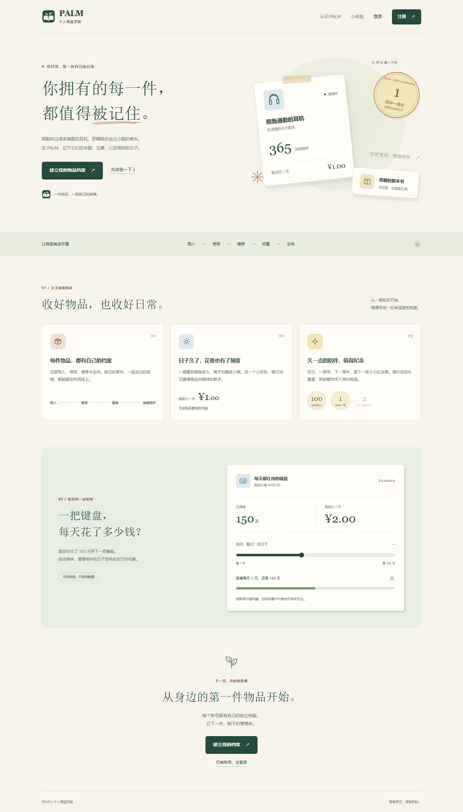
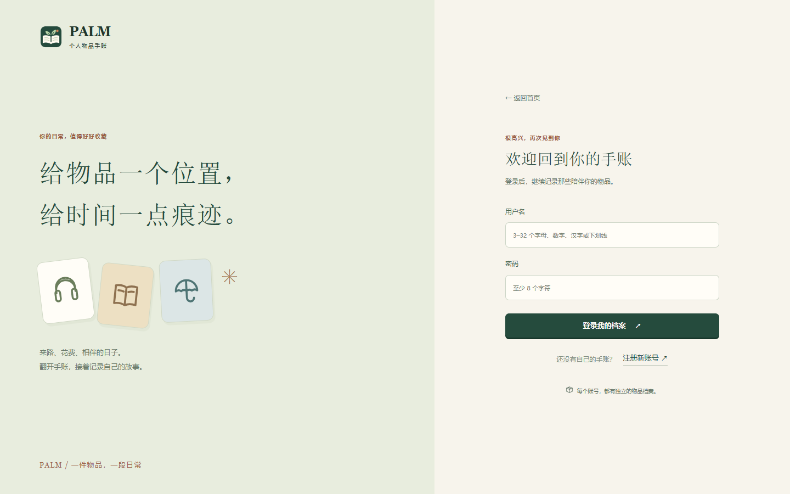
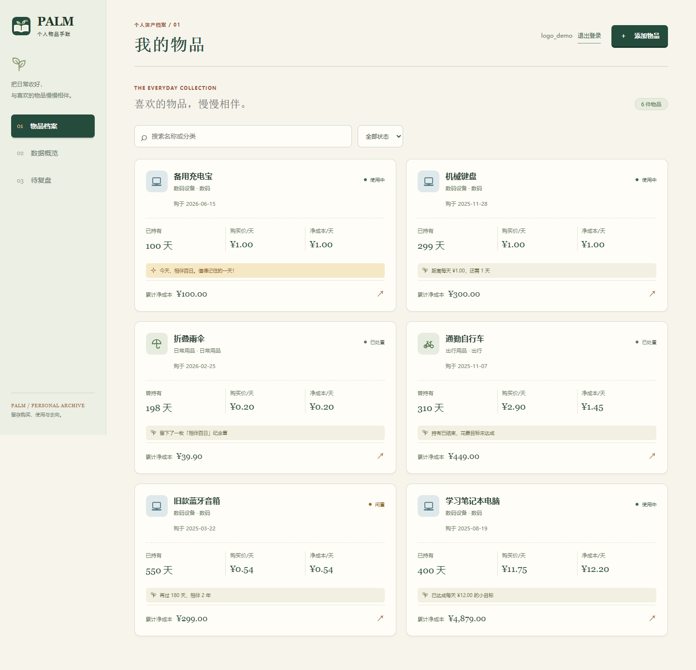
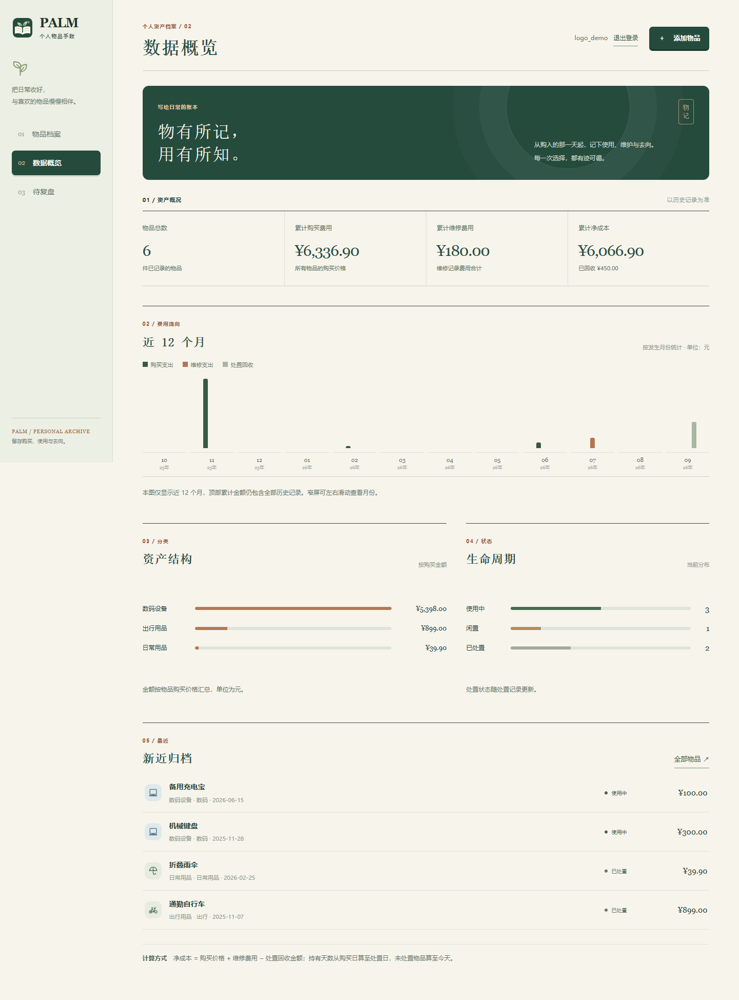
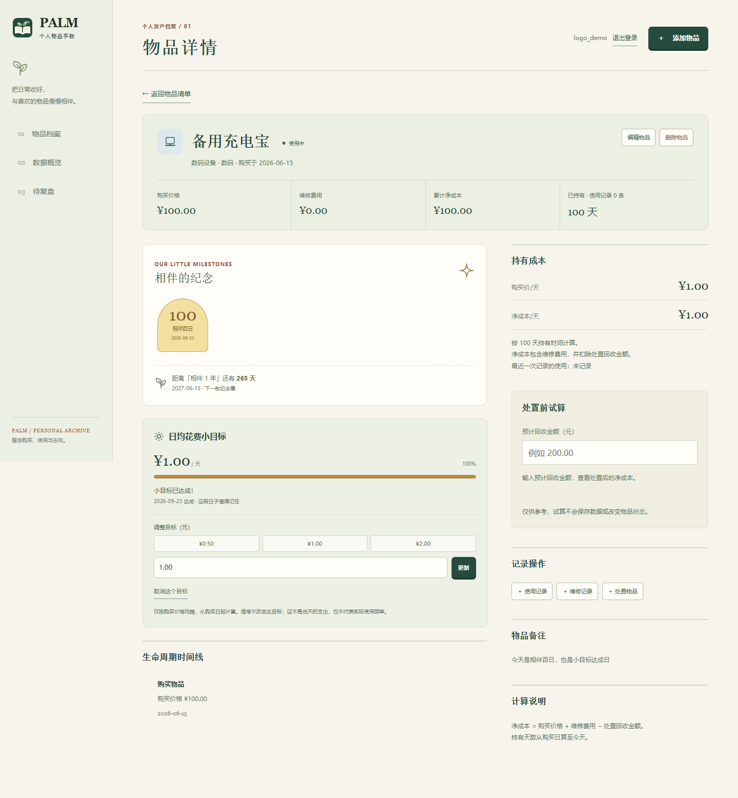

# PALM：个人物品资产生命周期管理平台


本地运行的多用户网页系统，以“个人物品手账”的形式记录物品从购买、使用、维修、闲置到处置的过程，并统计资产结构、使用成本，留下相伴纪念章与日均花费目标。不同账号的物品与统计相互隔离。前端使用 HTML、CSS、原生 JavaScript；后端使用 Python Flask；数据保存在 SQLite。

## 启动

需要 Python 3.10 或更新版本。以下命令在项目目录执行（Windows PowerShell）：

```powershell
python -m venv .venv
.venv\Scripts\python.exe -m pip install -r requirements.txt
.venv\Scripts\python.exe app.py
```

浏览器打开 <http://127.0.0.1:5000>，先看到介绍页，点击“登录”或“注册”进入对应表单，再开始记录。首次启动会自动创建数据库 `instance/palm.sqlite3` 和会话密钥 `instance/session.key`。停止服务后再次启动，账号和数据会保留；备份或迁移到另一台电脑时应同时保留数据库与密钥。系统只监听本机地址。

从旧版升级时，程序会在改动数据库前自动保存 `instance/palm.sqlite3.pre-accounts.bak`。**首位成功注册的用户将接收旧数据库中全部物品及其记录**，其他新用户从空档案开始。请由原数据的拥有者先注册；备份文件不会在后续启动时被覆盖。升级前先停止旧版服务，重要数据建议另存一份备份。

升级到物品类型图标版本时，程序会另存 `instance/palm.sqlite3.pre-icons.bak`，再给旧物品补充类型：`数码设备` → 数码、`日常用品` → 日常用品、`出行用品` → 出行，其他分类 → 其他。可在编辑物品时调整。已有分类、账号归属和费用记录不会改变。

升级到纪念日与目标版本时，程序会先保存 `instance/palm.sqlite3.pre-goals.bak`，再添加可为空的 `daily_target_cents` 字段（整数分），数据库版本升至 4。旧物品默认没有目标；纪念章根据原购买日期自动计算。重复启动不会覆盖备份或重置已设目标。上述备份只在对应字段缺失时生成，已有最新版数据库不再重复备份。

如需演示数据，先在页面注册一个账号，然后在**该账号没有物品**时运行：

```powershell
.venv\Scripts\python.exe seed_demo.py
```

脚本会提示输入已注册的用户名及密码（密码输入时不回显），仅向该账号导入。演示数据包含已达成花费目标的笔记本电脑、闲置音箱、目标未达成便出售的自行车、丢弃的雨伞、明天达成目标且超过 90 天未记录使用的键盘，以及当天相伴百日并达成目标的充电宝。所选账号已有物品时不会写入，以免混入真实数据。

## 页面入口与外观

| 页面 | 地址与行为 |
| --- | --- |
| 介绍页 | 未登录访问 `/`；展示功能、示例档案和可拖动的键盘日均花费体验。固定示例不会写入数据库，也不读取个人物品 |
| 登录、注册 | `/login`、`/register`；可互相切换或返回介绍页；成功后进入物品档案 |
| 我的档案 | `/app`；默认物品清单，支持数据概览、待复盘和详情；未登录时转到登录页 |

已登录访问 `/`、`/login`、`/register` 会进入 `/app`。退出登录后回到介绍页，可重新登录其他账号；登录失效会提示重新登录。认证与业务页面不缓存账号内容，恢复浏览器历史页面时会重新检查登录。

页面使用暖白、墨绿和淡彩标签，桌面物品卡片双列、窄屏单列；录入、详情、统计及认证页面使用同一套风格。品牌 Logo 是“手账与新芽”的本地 SVG，统一用于导航、登录页、加载画面、介绍页及浏览器标签；其他插画和图标也是本地 SVG。字体采用系统字体；动画遵循系统“减少动态效果”设置，无需外部字体、图片或图标服务。

以下为 2026-09-23 使用演示数据截取的页面效果；实际物品、金额和持有天数会随账号数据及日期变化。

### 登录前介绍页



### 登录界面



### 物品档案



## 功能与规则

- 使用用户名和密码注册、登录；主页面顶部显示当前用户名，点击“退出登录”后可登录其他账号。用户名为 3–32 个字母、数字、汉字或下划线，英文大小写视为同名；密码为 8–128 个字符。没有邮件找回或管理员重置密码功能，请妥善保存密码。
- 每个账号只能查看和操作自己的物品、使用及维修记录、处置记录、统计和复盘结果。会话使用本机生成的密钥签名，密码以哈希值保存；页面修改请求使用 CSRF 令牌。此版本供本机课程演示，不提供公网部署配置。
- 添加、编辑、删除物品；按名称或分类搜索，按状态筛选。
- 登录后默认进入“物品档案”：桌面双列、手机单列的卡片展示类型图标、名称、分类、状态、持有天数、购买价/天、净成本/天与累计净成本。主页只显示物品数量；“数据概览”在第二个导航项。
- 新增或编辑物品时可单独选择类型图标：数码、家居、日常用品、衣物、书籍文具、出行、运动、工具、其他。默认“其他”；“分类”仍可自由填写并用于原有搜索与分类统计。图标也会出现在详情、待复盘和数据概览的近期物品中。
- 添加、编辑、删除使用和维修记录；处置物品及修改或撤销处置记录。
- “数据概览”展示物品数量、费用合计、状态分布和分类资产金额；详情页显示时间线和单件成本。
- “数据概览”展示近 12 个自然月（含当前月）的购买支出、维修支出和处置回收图表；没有记录的月份显示为零。图表按事件日期归月，顶部累计金额仍统计全部历史。
- “待复盘”页面列出手动标记为闲置的物品，以及使用中、且距最近一次**记录的使用**已满 90 天的物品。没有使用记录的使用中物品单独显示为“使用情况未知”；已处置物品不参与复盘。提示仅供人工核对，不自动修改状态。
- 未处置物品的详情页支持处置前试算：输入预计回收金额即可查看预计净成本和回收比例。试算不保存，也不改变正式统计；仍需通过处置表单完成处置。
- 净成本 = 购买价格 + 维修费用 − 处置回收金额；持有天数 = 处置日（未处置则为今天）− 购买日。
- 购买价/天 = 购买价格 ÷ 持有天数；净成本/天 = 净成本 ÷ 持有天数，均保留两位小数。这是历史成本的均摊展示，并非当天实际支出。购买当天持有天数为 0，两种日均值显示“暂无”；已处置物品的天数固定在处置日，回收超过购买与维修支出时净成本/天可以为负。
- 试算中的预计净成本 = 购买价格 + 维修费用 − 预计回收金额，回收比例 = 预计回收金额 ÷（购买价格 + 维修费用）。累计支出为零时不计算回收比例；回收超过支出时净成本可以为负。
- 分类资产金额按购买价格累计，已处置物品也计入历史总额。金额保留两位小数，使用整数分存储。
- 新增使用或维修记录需要物品尚未处置。更正已有记录时，日期仍必须在购买日至处置日之间。删除处置记录后，物品设为“闲置”，可再手动改为“使用中”。
- 删除物品会同时删除其所有记录；系统仅在本机 `127.0.0.1` 提供服务。

### 数据概览展示



## 相伴纪念与花费目标

- **相伴纪念**：打开详情查看持有满 100 天及每个购买周年的纪念章、下一纪念日及倒计时。闲置期间也计入持有时间；2 月 29 日购买的物品在非闰年按 2 月 28 日纪念。已处置物品只保留截至处置日达成的纪念章。
- **设置目标**：在详情的“日均花费小目标”中选择 `0.50 / 1.00 / 2.00 元`或输入金额，点击“设定”；可更新或取消。新旧物品默认不启用。已处置物品只读，撤销处置后可以调整。
- **计算规则**：只按购买价计算，所需天数为购买价格除以目标金额向上取整，至少 1 天；进度为已持有天数除以所需天数，上限 100%，从购买日起算。内部使用整数分和未四舍五入的比较，页面显示两位小数不代表已达成目标。维修费用与回收金额不影响此目标。
- **边界**：目标金额必须大于零、最多两位小数且不超过 999999999 元。购买当天日均值仍为“暂无”，零价格物品在第 1 天起达成。预计日期超出可表示范围时显示“所需时间过长”。处置后进度冻结，已达成保留结果，未达成显示“持有已结束，目标未达成”。
- **更正记录**：更改购买价格、购买日期、处置日期或撤销处置后，纪念章与目标状态重新计算。它们是当前记录对应的结果，不是不可更改的历史奖励。
- **趣味反馈**：主页每张卡片最多一条提示，优先当天纪念日，其次目标，再次下一纪念日。当天达成的纪念章或目标首次打开详情时播放短动画；同一标签页按账号、物品和事件去重，刷新不会反复播放。浏览器禁用存储时退化为当次页面内去重。

日期沿用后端本机日期；刷新或重新打开页面会取得最新结果。均摊费用不是当天实际支出，纪念章和目标也不代表实际使用频率。

### 物品详情展示



## 接口

所有写入接口接收 JSON；金额字段使用元，返回的金额也是两位小数的字符串。先调用 `GET /api/auth/me` 获取 `csrf_token`，之后 `POST`、`PUT`、`DELETE` 请求均需发送 `X-CSRF-Token` 请求头。登录或注册后令牌会更新。业务接口未登录时返回 `401`，访问其他账号的记录返回 `404`，令牌缺失或错误返回 `403`。

| 用途 | 接口 |
| --- | --- |
| 当前会话 | `GET /api/auth/me`，返回 `user`（未登录为 `null`）和 `csrf_token` |
| 注册、登录、登出 | `POST /api/auth/register`、`POST /api/auth/login`（JSON：`username`、`password`）；`POST /api/auth/logout`。注册和登录返回 `user`、`csrf_token` |
| 物品列表、新增 | `GET/POST /api/items`，列表支持 `?q=关键词` |
| 物品详情、修改、删除 | `GET/PUT/DELETE /api/items/<id>` |
| 日均购买价目标 | `PUT /api/items/<id>/daily-target`；JSON：`{"amount":"1.00"}` 设置／更新，`{"amount":null}` 取消，返回更新后的完整物品详情 |
| 使用记录列表、新增 | `GET/POST /api/items/<id>/usage` |
| 使用记录修改、删除 | `PUT/DELETE /api/usage/<id>` |
| 维修记录列表、新增 | `GET/POST /api/items/<id>/maintenance` |
| 维修记录修改、删除 | `PUT/DELETE /api/maintenance/<id>` |
| 处置记录查看、新增 | `GET/POST /api/items/<id>/disposal` |
| 处置记录修改、删除 | `PUT/DELETE /api/disposal/<id>` |
| 统计 | `GET /api/stats` |
| 近 12 个月费用与复盘清单 | `GET /api/insights`，返回 `months`、`review_items`、`unknown_usage_items` 和 `review_threshold_days` |

物品新增和编辑接口支持 `icon_type`：`digital`、`home`、`daily`、`clothing`、`books`、`mobility`、`sports`、`tools`、`other`。新增时省略使用 `other`；编辑时省略则保留原类型；无效值返回 `400`。列表和详情均返回 `icon_type`、`holding_days`、`daily_purchase_cost`、`daily_net_cost`；两种日均值在持有不足一天时为 `null`。详情还返回 `last_recorded_use`（无记录时为 `null`）。

列表和详情还返回：

- `milestones`：`earned` 为已达成纪念章（`id`、`label`、`number`、`date`、`is_today`），`next` 为下一纪念章并带 `remaining_days`，已处置时为 `null`。
- `daily_target`：未设置时为 `null`；否则包含 `amount`、`status`（`pending`、`reached`、`closed`）、`required_days`、`remaining_days`、`progress_percent`、`estimated_date`、`reached_on`、`is_today`。预计日期仅在进行中且可表示时返回，达成日期仅在达成后返回。

目标接口与现有接口采用相同的认证和 CSRF 规则；缺少金额、非法金额或修改已处置物品的目标返回 `400`，访问他人物品返回 `404`。普通物品编辑不会清除已设目标。

## 验收与演示

运行自动化测试：

```powershell
.venv\Scripts\python.exe -m unittest discover -s tests -v
```

测试覆盖登录路由、用户隔离、原有生命周期与成本、百日和周年边界、闰日、目标精度、零价格、日期溢出、处置与撤销、旧数据库备份及重复迁移。
