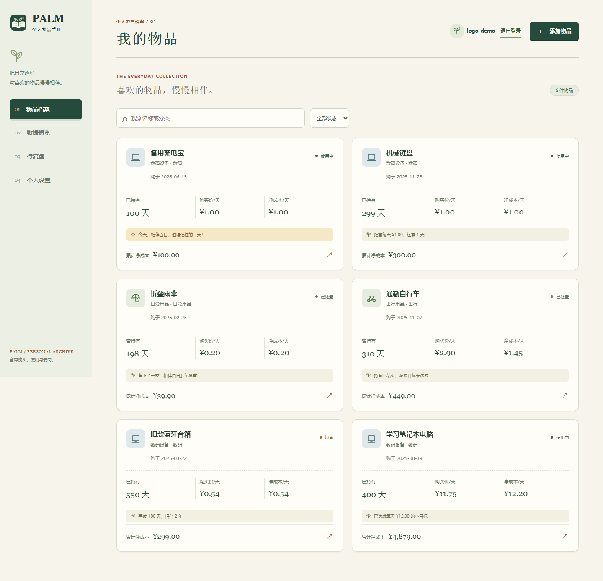

  

<h1 align="center">PALM</h1>

<strong>个人物品资产生命周期管理平台</strong>

  
  
  

  
  
  

  一款记录物品从购买 → 使用 → 维修 → 闲置 → 处置 
  完整生命周期的本地资产管理工具。

  
   登录后的物品档案首页

## 你可以用 PALM 做什么

- ✨ **生命周期管理**：记录购买、使用、维修、闲置与处置。
- 📊 **资产统计**：查看物品状态、分类分布和费用变化。
- 💰 **日均使用成本**：了解每件物品的持有天数与日均花费。
- 📅 **月度回顾**：按月回看购入、维修、回收与使用记录。
- 🧠 **智能分析**：基于规则生成保修、闲置和费用提示，不接入 AI。
- 🗑️ **回收站**：误删物品可在保留期内恢复。

## 开始使用

- **Windows 安装版**：从 [Releases](https://github.com/HHH0825/Personal-Asset-Lifecycle-Manager-PALM/releases) 下载安装；操作步骤见 [安装说明](packaging/windows/README.md)。
- **源码版**：Windows 双击 [启动 PALM.bat](<启动 PALM.bat>)，首次运行会自动配置环境。也可安装 `requirements-lock.txt` 中的依赖后运行 `python app.py`。

启动后访问 <http://127.0.0.1:5000>；关闭启动终端即可停止服务。

## 文档与测试

[使用说明](docs/user-guide.md) · [接口](docs/api.md) · [架构](docs/architecture.md) · [备份与升级](docs/backup-restore.md) · [测试与演示](docs/testing.md)

## 许可证

源码采用 [PolyForm Noncommercial 1.0.0](LICENSE)，允许符合条款的非商业使用；超出许可范围的商业使用须另行取得书面授权，可通过 [GitHub Issues](https://github.com/HHH0825/Personal-Asset-Lifecycle-Manager-PALM/issues) 联系作者。历史 MIT 授权及第三方许可见 [授权说明](docs/licensing.md)。
