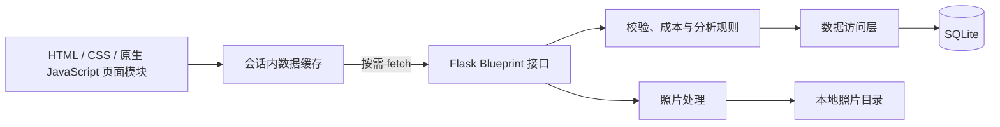

# 架构与数据组织

## 项目架构

`app.py` 是本地启动入口，也保留 `create_app` 的导入方式。`palm` 包按职责组织后端：应用工厂与统一请求保护在 `__init__.py`、`security.py`；数据库连接及版本 8 升级在 `database.py`、`schema.py`；账号、页面、物品、生命周期记录、统计、回收站、CSV 导出及月度回顾使用各自的 `routes_*.py`；SQL 集中在 `repository.py`，回收站和月度回顾规则分别在 `trash.py`、`reports.py`。纪念章与日均目标计算仍在`palm/journey.py`。

导入 `app` 或调用 `create_app()` 只配置应用，不创建数据库或密钥。`python app.py` 会显式调用 `initialize_app()`，生成或读取会话密钥、备份需要升级的旧数据库并完成初始化，然后启动服务。程序保留已有备份文件名，升级语句在事务中执行；升级失败会停止启动并回滚尚未提交的变更。旧数据和照片目录沿用原位置。

物品列表一次批量读取各物品的维修合计、使用次数、最近使用日期、今日记录和处置结果；统计与智能分析复用这些汇总值。使用与维修分别汇总后再关联物品，避免多条记录相互放大金额或次数。金额仍按整数分计算，接口地址及返回格式保持不变。

前端使用浏览器原生 ES Modules，不需要打包工具。`static/js/app.js` 负责登录初始化、导航和操作协调；`static/js/` 内的 `api.mjs` 处理请求与会话错误，`data-store.mjs` 管理会话内读取缓存，`navigation.mjs` 处理地址片段，`items.mjs`、`detail.mjs`、`dashboard.mjs`、`analysis.mjs`、`account.mjs`、`report.mjs` 分别渲染页面。`forms.mjs` 管理录入与照片预览，`common.mjs`、`feedback.mjs` 提供公共展示与提示。

公共配色、按钮和基础组件在 `static/css/style.css`；登录前首页、认证页和登录后页面通过模板加载各自的布局与手账样式，公共响应式规则在 `style-responsive.css`、`notebook-responsive.css` 中。保留原有 HTML、CSS、原生 JavaScript 与页面外观。
