# 物物记 · 微信小程序版

**物物记**是 PALM 项目的独立微信小程序版，介绍语为“每件物品，都有自己的故事”。`wechat/` 可单独复制使用，数据库、照片、微信登录资料均由本目录的后端保存；原单机网页版的 `instance/` 和账号不会自动同步，也不需要运行原网页版。

## 目录

```text
wechat/
├─ backend/          独立 Flask 服务与业务规则副本
├─ miniprogram/      物物记原生小程序（WXML、WXSS、JavaScript）
├─ tests/            Python 与 Node 测试
├─ deploy/           Linux 服务器部署模板
├─ docs/             接口、部署及演示说明
├─ requirements-lock.txt
└─ .gitignore
```

业务副本依据原项目提交 `7763b2d6cb4d869b0695e380fb38d63c0ebfd0d8`，独立版本后续修复需分别维护。数据结构与原项目相似，但版本号为 9，**不要将两个版本指向同一数据库**。

## 本机开发

需要 Python 3.10+、微信开发者工具；运行前端测试还需要 Node.js。以下命令在 `wechat/` 目录执行：

```powershell
py -3 -m venv .venv
.\.venv\Scripts\python.exe -m pip install -r requirements-lock.txt
.\.venv\Scripts\python.exe backend\dev.py
```

专用本地入口 `backend/dev.py` 会开启模拟登录，并显示“本地模拟登录已开启”和地址 `http://127.0.0.1:5001`；只允许本机访问，不需要每次设置环境变量。本机数据仍写入 `wechat/instance/`，沿用原有调试账号和物品。关闭该终端或按 `Ctrl+C` 停止服务。

用微信开发者工具导入 `wechat/miniprogram/`。检查 `project.config.json` 中的 AppID：使用自己的小程序 AppID，或选择测试号进行本地页面和接口联调。在工具中暂时关闭域名校验，保持 `miniprogram/config.js` 的 `DEV_LOGIN: true` 和 API 地址 `http://127.0.0.1:5001`。按钮显示“登录体验”，下方注明“开发者工具模拟登录”，会以 `dev:student` 建立本地测试账户。要检查多账户隔离，可暂时修改 `DEV_ACCOUNT` 为另一个名称，退出后重新登录。**这种模拟登录只能用于本机开发，不能作为体验版认证。**

原有入口也可继续使用，在同一个 PowerShell 窗口中执行：

```powershell
$env:PALM_WECHAT_DEV_LOGIN = '1'
.\.venv\Scripts\python.exe backend\app.py
```

若显示“本地调试登录未开启，请使用本地开发启动入口”，先用 `Ctrl+C` 停止旧服务，再运行 `backend/dev.py`，然后重新编译小程序。环境变量仅对当前 PowerShell 及其启动的程序生效，设置后需要重启后端。若正式模式显示“服务器尚未配置微信登录”，应按部署说明在服务器配置微信凭证；本地调试不需要 AppSecret。启动提示端口占用时先停止原有的 5001 服务，不要同时运行两个入口。

若显示“连接失败，请检查网络和后端地址”，先在浏览器访问 `http://127.0.0.1:5001/healthz`。返回 `{"ok":true}` 表示服务可达；再查看开发者工具控制台或 Network 中失败请求的实际地址，应为 `http://127.0.0.1:5001/api/mp/auth/login`。若配置文件已是 5001，但请求仍指向旧端口（例如临时检查使用的 5002），重新保存 `config.js`，通过“工具 → 编译”（`Ctrl+R`）完整编译；仅刷新模拟器可能继续使用旧编译产物。恢复测试配置后也要核对实际请求，不能只检查文件内容。此操作不需要删除物品数据或重新安装依赖。

若“新增”、个人资料点击无反应，或“发现”连固定标题都没有显示，先通过“工具 → 编译”（`Ctrl+R`）完整编译，再用“项目 → 重新打开此项目”重新建立调试会话。本次在正常项目实际复现了这些异常；关闭自动热重载、重新加载后，同一份页面源码恢复跳转及发现内容。项目默认关闭 `compileHotReLoad`；已有项目的 `project.private.config.json` 可能覆盖公共配置，需要同时核对本地“自动热重载”选项。不要通过删除数据库、会话或照片解决页面渲染问题；这个对照结果也不代表所有空白页都由热重载导致。

个人资料、新增和物品详情入口会阻止重复点击；跳转失败显示“页面暂时无法打开，请重试”，具体跳转原因写入开发者工具控制台。返回来源页面后可再次打开。纸签、头像及背景仅作装饰，不接收按钮点击。

“发现”分别读取统计和分析，一部分失败时仍显示另一部分成功内容，并提供“重新读取统计”或“重新整理分析”。加载失败不会显示为零物品或空分析；返回格式异常也会给出提示。离开页面、快速重复读取或切换账号后，旧响应不再更新当前页面。

## 功能范围

- “物品”：搜索、状态筛选、新增和编辑物品、保修日期、照片、置顶、日均费用与持有天数。
- 详情：使用、维修、处置记录的新增、修改、删除；“今天用过”防重复记录；物品删除进入回收站。
- “发现”：累计费用、物品数量及基于规则的保修、使用与费用分析。
- “我的”：点击顶部头像与昵称栏进入“个人资料”，修改显示名称及六种预设头像；小芽、猫咪、书本、太阳、单车、星星使用原创收藏册插画，切换时即时预览，保存后显示在“我的”，再次打开仍保留。图片失败时回退文字标记；主页保留回收站与退出登录。
- “个人资料”：读取成功后可编辑，保存成功返回“我的”；未保存就返回不提交修改。昵称与头像同步当前会话，重新打开仍可读取；读取失败可重试，提交失败保留填写内容。

## 界面与配色

界面采用**旧纸收藏册**：燕麦纸 `#F2EADF` 背景、暖白纸 `#FFFCF7` 卡片、浅纸色 `#F5EFE5` 指标栏和柔杏 `#E3BFA6` 主按钮。页头用鼠尾草绿 `#DDE4D7` 格纹、陶粉 `#E8D1C8` 纸片与奶咖 `#E7D6BD` 胶带形成拼贴，背景叠加轻纸纤维纹理。卡片、输入框和费用区域保持纯色；正文和数字为深可可 `#493B35`，辅助文字加深为 `#635147`，强调与选中导航使用棕红 `#845645`。颜色和尺寸集中在 `miniprogram/app.wxss`，不增加运行依赖。

清单的“新增”改为猫爪、加号和折角纸签；“收藏的小日常”使用窄纸条与小印章。录入表单的 **01 基本信息、02 购买与保修、03 照片与备注**分别使用档案书签、购买票据、照片角贴与铅笔。原文和编号通过原生组件显示，图案加载失败也能读到文字；新增仍是原生按钮，整块 46px 高度可点击。七种纸签、九种类型插画、猫爪收藏册 Logo 与三种背景均保留可编辑 SVG，页面使用同步导出的透明 PNG；素材和重新导出步骤见 [纸签素材说明](docs/paper-assets.md)。

三项指标继续使用细线分隔的统一账本栏；详情保持两列布局。发现使用白纸分析卡与类别小标记；“我的”保持可点击的头像昵称栏，资料编辑位于独立页面。登录使用收藏册入场券，保存使用归档票据，暖白纸面配细棕线与少量胶带；“今天用过”保留柔杏色；次要操作及恢复使用纸色和细边框，永久删除使用陶红文字。状态保留文字，不仅通过颜色表达。普通文字与底色对比度不低于 4.5∶1，包含页头纸片、纸纹、按钮和禁用状态。

- 拼贴随内容自然滚动，不占布局、不接收点击；每页集中于页头与边缘，不在每张物品卡重复堆叠。已移除柔光渐变、星星和鲜亮矩形标题，不增加连续动画。
- 登录前保留收藏盒小猫和示例档案，配合鼠尾草与陶粉纸片、收藏章和纸券登录入口，明确标注“示例档案 · 非账户数据”；示例不参与统计。短屏可以正常向下滚动，登录按钮不固定在屏幕底部。
- 六张原创透明 PNG 贴纸覆盖首页、清单、发现、我的、表单、生命周期和回收站，搜索无结果时显示找物品的小猫。贴纸合计约 157 KiB，纸签、导航、头像、类型插画与背景 PNG 合计约 377 KiB，全部随小程序打包；装饰有独立预留空间，不遮挡字段和按钮。素材和完整生成提示见 [贴纸说明](docs/stickers.md)。
- 登录页通过 `miniprogram/utils/layout.js` 读取可用窗口尺寸，插画高度限制在 140–220px，随窗口高度调整，并响应窗口尺寸变化。全站内容最大宽度 480px、居中显示；字号与控件采用稳定的逻辑像素尺寸，底部保留安全区域，避免大屏按比例放大或短屏挤压内容。不按机型名称写死布局。
- 物品清单突出持有天数、购买价/天和净成本/天；有照片时显示缩略图，无照片或读取失败时显示对应类型线条插画。
- 缩略图仅在物品卡片进入视野后读取，最多同时读取三张，并发读取同一照片会复用请求。临时图片路径只存在当前页面内，离开页面、重新读取清单或切换账号时清除，不写入浏览器或小程序持久存储。
- 详情用时间线展示生命周期；发现展示统计摘要与规则卡片；录入表单按基本信息、购买与保修、照片与备注分组。
- 底部“物品、发现、我的”使用原生图文导航，分别为猫爪收藏盒、放大镜档案页、猫耳头像档案卡；普通与选中版本保持相同形状，选中增加棕红轮廓和少量拼贴色。SVG 源文件与 81×81px 透明 PNG 随包提供，不使用自定义导航或图标库。

检查界面时可在开发者工具切换窄屏设备、输入长名称，核对表单焦点、错误提示和键盘弹出后的布局。登录、计算、接口和数据库字段均沿用原有规则。

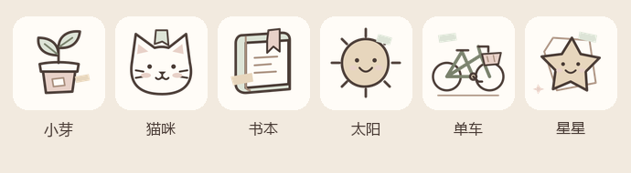

登录纸券本地模式显示“登录体验”，正式模式显示“微信登录”；新增与编辑的归档票据保留“保存物品”。两种入口都是原生按钮，高度 56px、居中且宽度不超过 360px 和页面可用宽度；加载时显示“登录中…”或“保存中…”并禁用重复点击。图案没有嵌入文字，图片失败仍能读取和点击原生文字。首页左上角使用 32×32px 的猫爪收藏册 Logo，旁边保留“物物记”，图片失败回退“物”字。微信后台头像未更换，底部导航文字保留，新增对应的纸签图标。

### 物品照片

点击“选择照片”或“重新选择”，明确选择“从相册选择”或“拍一张照片”；相机默认后置，每次一张。预览后可选择“裁剪”（1∶1，可调整取景范围）或“旋转”（每次顺时针 90°），也可直接保存。编辑已有物品时自动读取原照片；读取失败可重试，继续保存其他信息不会删除原照片。

照片只在点击“保存物品”后上传；操作仅生成临时图片，不修改相册原图。选图、裁剪和旋转期间禁用重复操作及保存；取消或失败保留之前的照片，权限被拒绝会提示用户自行检查设置。裁剪需微信基础库 2.26.0，旧版本仍可选图、拍照与保存；旋转输出最长边不超过 1600px 的 JPEG。上传沿用 5 MB 限制与部分成功提示。开发者工具不能代替真机验证相机与原生裁剪，详见 [照片功能说明](docs/photos.md)。

### 页面展示

以下为此前页面检查截图；首页使用内置示例，录入表单尚未提交。最新收藏册功能截图见后面的“收藏册、纪念与月度小报”。

| 登录前首页（Mate 80） | 录入上半部（Mate 80） | 录入下半部（Mate 80） |
| --- | --- | --- |
| 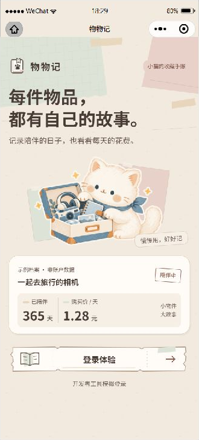 | 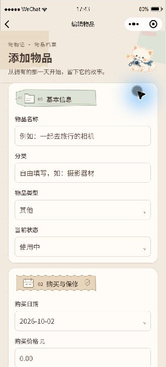 | 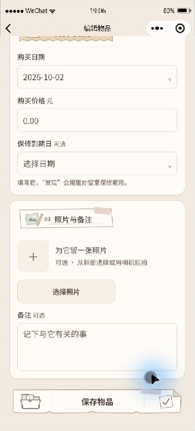 |

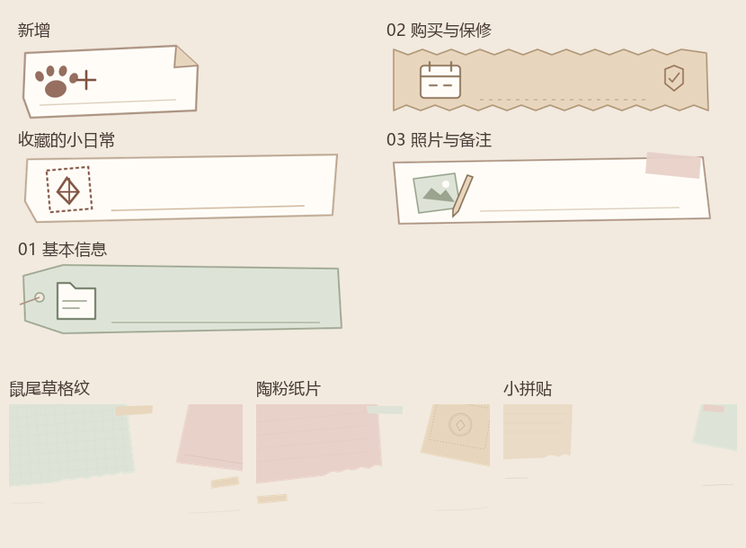

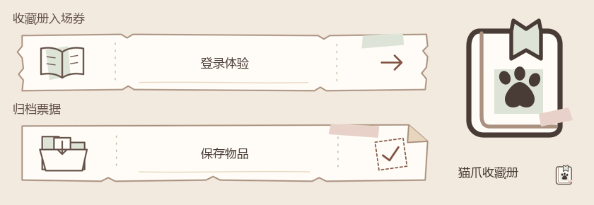

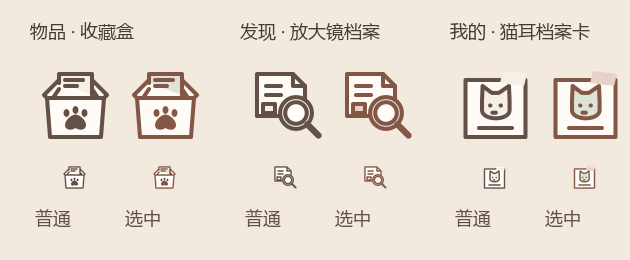

| 原生导航（Mate 80，空清单） | 照片来源菜单（Mate 80，未选择） |
| --- | --- |
| 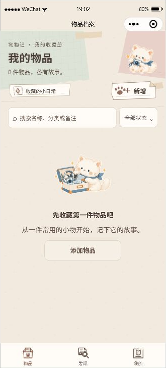 | 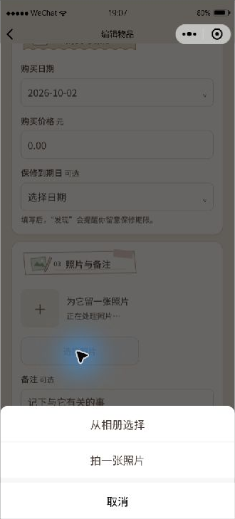 |

更多页面截图、实际检查结果及真机待验证项目见 [界面验收记录](docs/visual-check.md)。

### 入口右对齐

物品页“新增”位于工具栏右端，与搜索框及卡片右侧对齐，保留 104×46px 点击区域。发现页“本月记录”标题居左，“收藏小报”居右，点击高度至少 44px。手机仍保留原边距，平板入口跟随居中的收藏册内容区，两处均随内容滚动。

| 物品页新增（Mate 80 模拟尺寸） | 发现页收藏小报（Mate 80 模拟尺寸） |
| --- | --- |
| 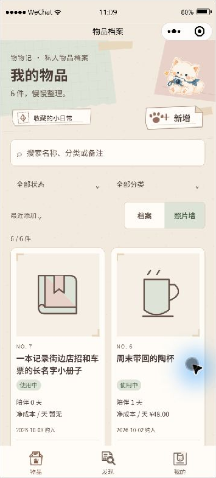 | 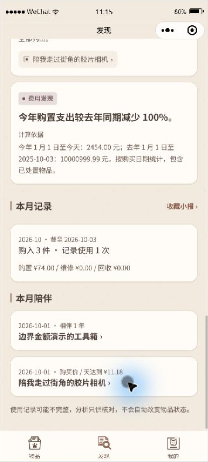 |

本轮在独立项目检查 320×568、366×809、390×844、430×932 和 768×1024 的入口位置；实际页面与操作覆盖范围见 [本轮验收记录](docs/visual-check.md#入口右对齐与屏幕适配检查2026-10-03)。模拟器结果不代替真机和系统键盘验收。

| 发现页（独立虚构数据） | 后端停止时的分别重试 |
| --- | --- |
| 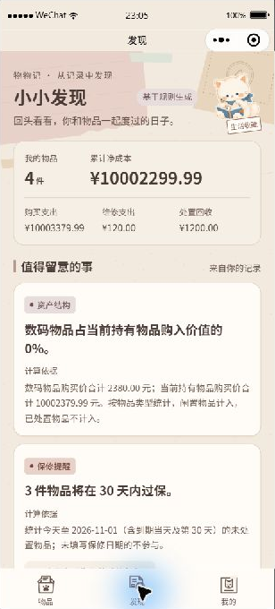 | 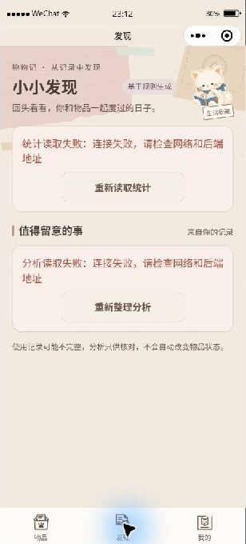 |

独立测试项目的物品清单使用虚构数据，已检查 320px、390px、430px、Mate 80 和平板的列表与导航排版；这些截图不代表相机、裁剪或真机验收已完成。

| 窄屏（320px） | Mate 80（366px） | 平板（768px） |
| --- | --- | --- |
| 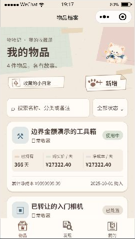 | 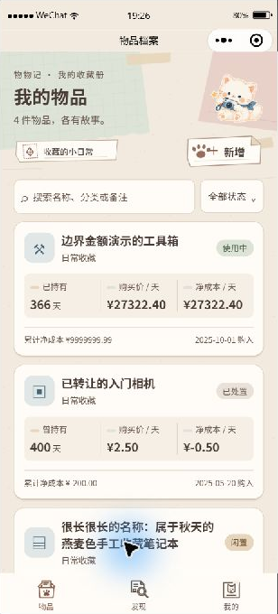 | 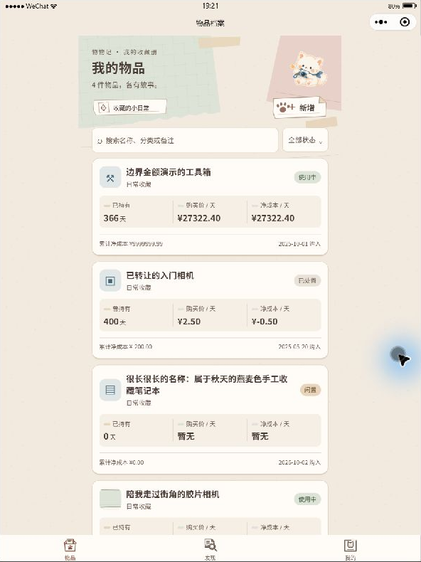 |

回收站保留 30 天；后端启动及访问回收站时清理到期物品。日均净成本为 `(购买价 + 维修费 - 回收金额) ÷ 持有天数`；购买当天显示“暂无”。规则分析基于录入数据，不自动推断物品闲置。现已支持月度收藏小报和 PNG 图片保存；CSV、订阅提醒和单机版数据同步留待后续。

## 真机体验版

真机需要自己的小程序 AppID、可从手机访问的 HTTPS 后端和已配置的合法 request/upload/download 域名。先按 [部署说明](docs/deployment.md) 配置服务器与微信后台，再将 `miniprogram/project.config.json` 的 AppID 和 `miniprogram/config.js` 的 API 地址替换成自己的值，并设 `DEV_LOGIN: false`。**AppSecret 只放服务器环境变量，不写进小程序文件。**然后在微信开发者工具里上传代码、设置体验成员并用 Android 和 iPhone 验证。

真机联调和上传体验版还需确认 AppID 所属账号、服务器、合法域名及体验成员配置，本机模拟器检查不能替代这些步骤。具体检查步骤见 [演示说明](docs/demo.md)。

## 收藏册、纪念与月度小报

物品主页可在“档案”和“照片墙”之间切换：档案为单列，展示约 80px 照片和完整费用；照片墙为规则双列，展示正方形照片、两行名称、状态、持有天数和净成本/天。照片缺失或读取失败时显示对应类型线条插画。照片角贴、档案编号和日期戳统一使用旧纸收藏册样式，正文整齐对齐。

搜索、状态、分类共同筛选；排序有最近添加、持有最久、购买价格从高到低、净成本/天从高到低。置顶优先、相同值按编号降序，日均“暂无”排最后。清除筛选保留排序与视图；这两项偏好按账号保存，不持久化物品清单。详情返回会恢复条件与可用滚动位置，切换账号清除页面内容和返回位置。

未处置物品在两种视图下均可点“今天用过”，同一天不会重复插入；已记录会显示“今天已记录”。照片仍按可见区域读取。新增、编辑和照片处理流程沿用现有操作。

详情页“陪伴纪念”展示相伴百日、周年、下一次纪念日期及剩余天数，默认最近三枚，可展开全部。“我的 → 陪伴纪念册”按达成日期倒序汇总。纪念按购买日计算，非闰年 2 月 29 日周年按 2 月 28 日计算，已处置物品截至处置日；回收站物品不参与，恢复后重新出现。

详情还可设置、修改或取消“日均小目标”，金额必须大于零。目标使用 **购买价 ÷ 持有天数**，不会将维修或回收计入，也不代表实际省下的钱。购买当天日均显示“暂无”；已处置物品的目标只读。

发现页增加“本月记录”“本月陪伴”和“收藏小报”入口，统计、规则分析与月度数据独立加载及重试。小报支持当前月与历史月；日期以服务器口径为准，当前月截至今天，历史月截至月末。购入件数和支出按购买日期、维修按维修日期、回收按处置日期、使用次数按记录的使用日期归月。已处置物品保留有效历史事件，回收站物品排除。

小报按当前保存的记录重新计算，更正记录、修改目标、删除恢复物品后，历史结果会变化。提供 PNG 预览及保存到相册：包含 Logo、月份、五项数字，以及最多三件购入物品和三条纪念；超出部分注明数量，不包含昵称或照片。相册权限失败时保留网页并可重试，切换月份或读取失败会清除旧图片。没有新增数据库字段。

本地源码更新后需要重启后端，让新月度接口生效，再在开发者工具完整编译。正常地址仍为 `http://127.0.0.1:5001`。

### 新功能实际效果（独立虚构数据）

| 单列档案 | 双列照片墙 | 日均小目标 |
| --- | --- | --- |
| 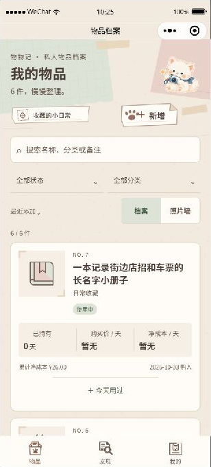 | 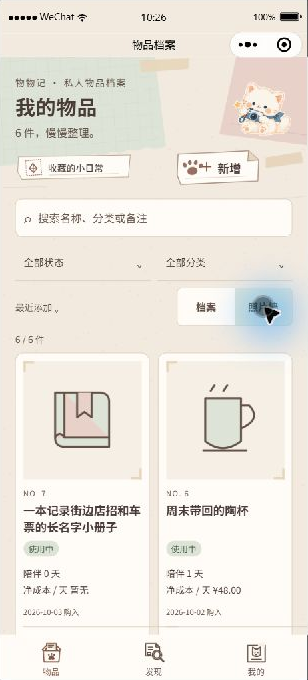 | 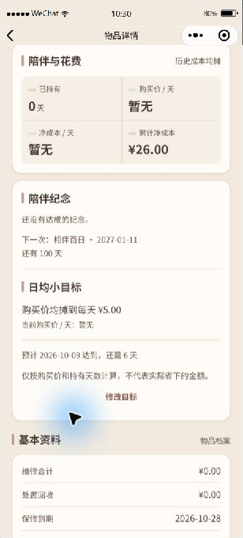 |

| 陪伴纪念册 | 收藏小报 | 原生 PNG 预览 |
| --- | --- | --- |
| 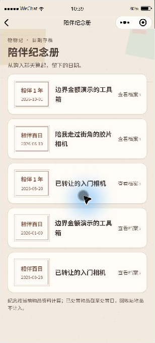 | 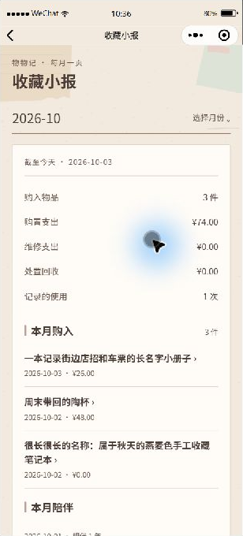 | 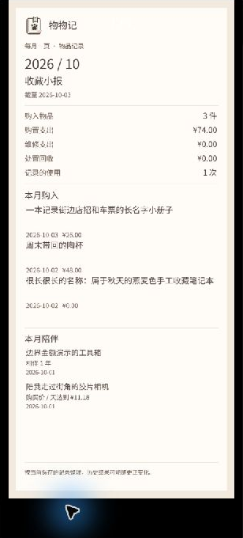 |

以上为开发者工具截图，虚构账号的数据与正常项目独立。相册保存和真机表现另行验证。

## 测试

在 `wechat/` 目录、安装 Python 依赖后：

```powershell
.\.venv\Scripts\python.exe -m unittest discover -s tests -p 'test_*.py' -q
node --test tests\frontend.test.cjs
node --test tests\navigation-discovery.test.cjs
node --test tests\collection.test.cjs
```

`collection.test.cjs` 验证组合筛选、排序、账号偏好、类型素材、返回位置、快捷记录、目标、月度读取与图片排版；后端 `test_monthly.py` 和 `test_journey.py` 验证归月及日期边界。

`navigation-discovery.test.cjs` 针对入口跳转、重复点击与失败重试，以及发现页部分失败、响应结构校验、乱序请求和账号切换保护；可单独运行进行本轮定向检查。

后端测试只使用临时数据库和照片目录，还会将后端复制到独立临时目录验证脱离上级项目运行。登录测试直接覆盖本地认证分支，检查调试开关、非本机拒绝、重启复用账号与缺少正式凭证的错误。前端测试覆盖筛选、金额展示、旧账号响应丢弃、缩略图并发限制、失败回退、按可见区域读取和页面离开后的清理，以及短屏/宽屏布局、窗口尺寸读取失败时的默认布局、窗口变化时的适配、主题文字对比度、SVG/PNG 素材引用与三倍导出尺寸、Logo 图片失败回退、纸签图片失败的文字回退、登录和物品保存的重复点击拦截与错误后重试、照片上传失败的部分成功提示、登录凭证模式和登录失败后的会话保留，以及资料保存去重、读取失败重试、未保存返回、会话持久化、账号切换及页面离开后的旧响应保护。新增照片测试覆盖明确相册／相机来源、取消、权限拒绝、编辑失败、裁剪兼容提示、旋转尺寸与 EXIF 朝向、仅上传最终图片、原照片预览不重复上传，以及离开页面或切换账号后的旧回调丢弃。接口字段见 [接口说明](docs/api.md)。
