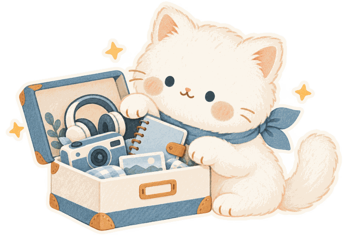

# 物物记：小猫贴纸素材

## 风格与使用

奶油色小猫搭配雾蓝围巾，使用柔和水粉与彩铅质感、杏橙腮红和星星。六张图片通过 Codex 内置 `image_gen` 工具分别生成，后五张以首页小猫作为角色与风格参考；请求均设置透明背景。生成后缩小并压缩为带透明通道的本地 PNG，保留原有透明背景，未增加运行依赖。



| 文件（位于 miniprogram/assets/stickers/） | 尺寸 | 页面用途 |
| --- | --- | --- |
| collector.png | 720×480 | 登录前首页与未录入物品的空状态 |
| camera.png | 320×292 | 物品清单、录入物品 |
| journal.png | 320×292 | 发现、生命周期标题、记录表单与空记录 |
| wave.png | 320×293 | 我的 |
| keepsake.png | 320×292 | 回收站 |
| search.png | 320×292 | 搜索无结果 |

素材合计 160,643 字节（约 157 KiB）。所有图片随小程序本地打包，未使用远程图床。底部三个导航图标不在本轮范围内。

页面使用 `image` 和 `aspectFit` 展示贴纸，容器预留尺寸，装饰设置 `aria-hidden` 与不接收点击，必要说明由旁边的文字提供。图片缺失时仍保留文字与布局空间。纸胶带、书签与分隔线使用 WXSS 完成。

## 生成提示记录

以下为本次实际使用的提示。参考图片用于保持角色一致，没有将页面截图送入生成工具。

### collector.png

```text
Use case: illustration-story. Asset type: transparent PNG hero sticker for the Chinese mini program 物物记. Draw one original cute cream-colored round-faced kitten with tiny dark blue-gray dot eyes, pink/apricot cheeks, tiny triangular ears, short chubby paws, and a mist-blue neckerchief. The kitten is carefully arranging a small open collection box containing a simple blue camera, headphones and a notebook. Soft hand-drawn gouache colored-pencil sticker illustration, crisp simplified silhouettes and subtle paper-like texture, no glossy 3D. Palette cream #F7F5EF, mist blue #42657A, soft blue #EAF0F3, apricot #D99564, dark blue-gray #293C46. Centered horizontal composition occupying most of canvas, full kitten and box visible, small star accents, white sticker rim, true transparent background including outside sticker, no words, no lettering, no watermark, no opaque rectangular background. Happy gentle collector personality. Artwork must be legible at 200px high, minimal tiny details.
```

### camera.png

```text
Use case: illustration-story. Create one transparent PNG sticker, using the attached image only as the CHARACTER AND STYLE REFERENCE. Match its cream round kitten, dark dot eyes, apricot cheeks, short chubby paws and mist-blue neckerchief, delicate colored-pencil gouache paper texture and white sticker rim exactly. Palette cream #F7F5EF, mist blue #42657A, light blue #EAF0F3, apricot #D99564. Center the full subject, compact composition with very little transparent margin, true transparent background, no text, no watermark, no rectangular backdrop or ground plane, no floating scenery. Clear silhouette legible at 64px. NEW POSE: Kitten sitting and happily hugging one small mist-blue camera, one apricot star beside it.
```

### journal.png

```text
Use case: illustration-story. Create one transparent PNG sticker, using the attached image only as the CHARACTER AND STYLE REFERENCE. Match its cream round kitten, dark dot eyes, apricot cheeks, short chubby paws and mist-blue neckerchief, delicate colored-pencil gouache paper texture and white sticker rim exactly. Palette cream #F7F5EF, mist blue #42657A, light blue #EAF0F3, apricot #D99564. Center the full subject, compact composition with very little transparent margin, true transparent background, no text, no watermark, no rectangular backdrop or ground plane, no floating scenery. Clear silhouette legible at 64px. NEW POSE: Kitten looking down and flipping an open small blue notebook with blank pages, one pencil in its paw.
```

### wave.png

```text
Use case: illustration-story. Create one transparent PNG sticker, using the attached image only as the CHARACTER AND STYLE REFERENCE. Match its cream round kitten, dark dot eyes, apricot cheeks, short chubby paws and mist-blue neckerchief, delicate colored-pencil gouache paper texture and white sticker rim exactly. Palette cream #F7F5EF, mist blue #42657A, light blue #EAF0F3, apricot #D99564. Center the full subject, compact composition with very little transparent margin, true transparent background, no text, no watermark, no rectangular backdrop or ground plane, no floating scenery. Clear silhouette legible at 64px. NEW POSE: Kitten facing viewer, sitting with one paw raised to wave hello, gentle smile, tiny heart beside raised paw.
```

### keepsake.png

```text
Use case: illustration-story. Create one transparent PNG sticker, using the attached image only as the CHARACTER AND STYLE REFERENCE. Match its cream round kitten, dark dot eyes, apricot cheeks, short chubby paws and mist-blue neckerchief, delicate colored-pencil gouache paper texture and white sticker rim exactly. Palette cream #F7F5EF, mist blue #42657A, light blue #EAF0F3, apricot #D99564. Center the full subject, compact composition with very little transparent margin, true transparent background, no text, no watermark, no rectangular backdrop or ground plane, no floating scenery. Clear silhouette legible at 64px. NEW POSE: Kitten gently resting its paws on a small keepsake box holding a folded scarf and one notebook, serene and caring, no trash bins.
```

### search.png

```text
Use case: illustration-story. Create one transparent PNG sticker, using the attached image only as the CHARACTER AND STYLE REFERENCE. Match its cream round kitten, dark dot eyes, apricot cheeks, short chubby paws and mist-blue neckerchief, delicate colored-pencil gouache paper texture and white sticker rim exactly. Palette cream #F7F5EF, mist blue #42657A, light blue #EAF0F3, apricot #D99564. Center the full subject, compact composition with very little transparent margin, true transparent background, no text, no watermark, no rectangular backdrop or ground plane, no floating scenery. Clear silhouette legible at 64px. NEW POSE: Kitten holding one simple blue magnifying glass in front of its face, curious expression, two small sparkles.
```

