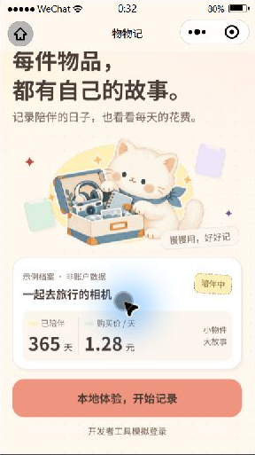
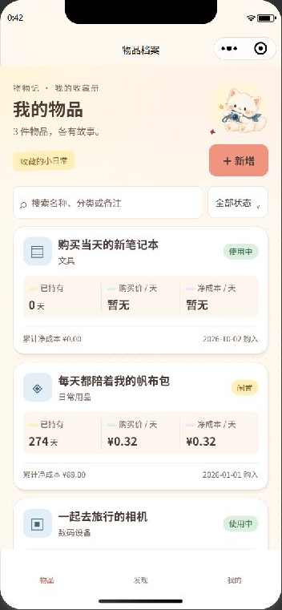
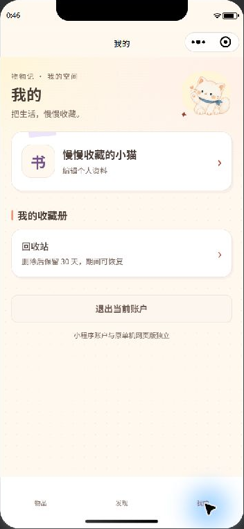
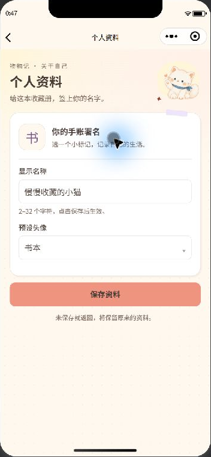
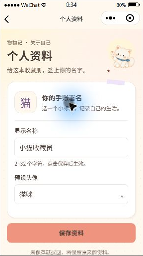
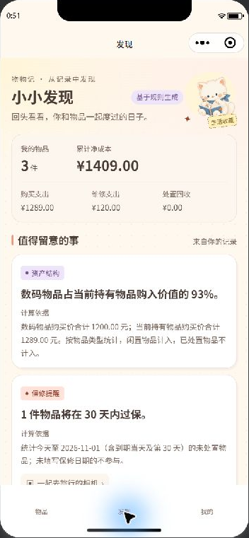
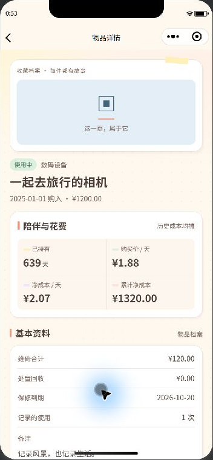
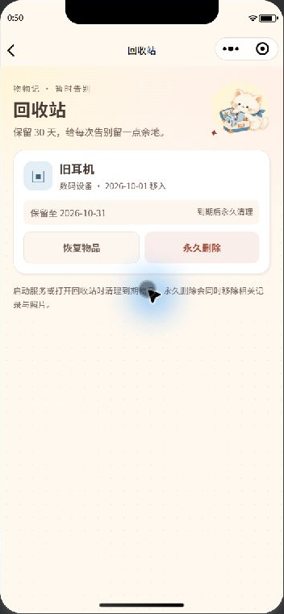
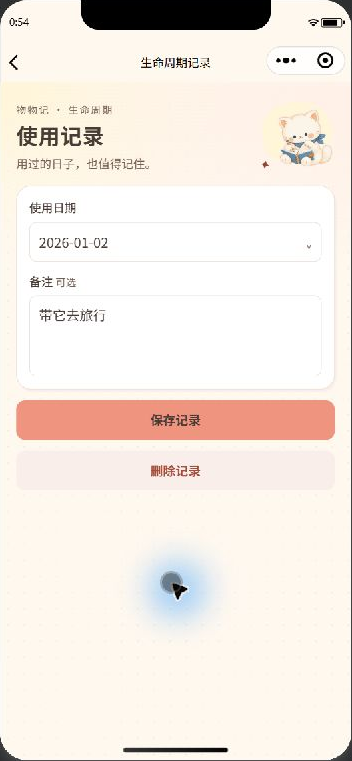
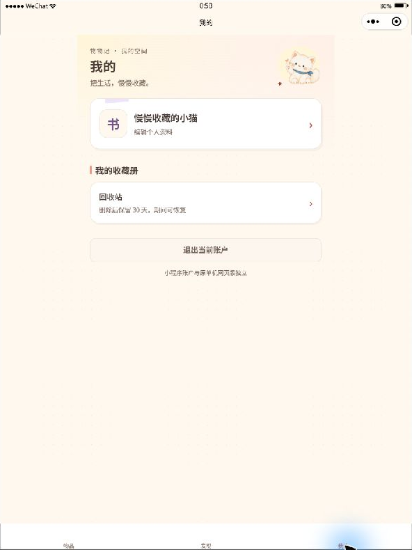

# 物物记：背景层次与个人资料验收记录

本轮采用“奶油纸张＋轻量拼贴”：公共背景增加低对比度细点纸纹，页头增加淡蜜桃和奶黄色底衬，配合现有小猫、胶带和收藏章。白纸卡片与输入框保持纯色，指标栏保持统一浅奶油底色。装饰不占布局、不接收点击，随页面自然滚动；没有新增图片依赖、底部图标或连续动画。

“我的”只展示可点击的头像昵称栏、回收站和退出登录。资料编辑移到非底部导航页面 `/pages/profile/index`；继续使用六种预设头像，以及 `GET /api/mp/auth/me`、`PUT /api/mp/profile`。没有改动后端接口和数据库。

## 自动检查

- 前端 **19 项测试全部通过**。新增覆盖资料保存去重、读取失败与重试、提交失败保留草稿、未保存返回、独立页面返回兜底、会话持久化、乱序响应、账号切换、页面离开后的旧响应，以及本地存储失败的部分成功提示。
- 后端 **9 项测试全部通过**，测试使用临时数据库和照片目录。
- JavaScript 语法与 JSON 检查通过；微信开发者工具自带编译器成功编译 **9 个 WXML 页面、10 个 WXSS 文件**。
- **27 组文字与底色组合**对比度均达到 4.5∶1，包括纸纹、页头底衬、账本栏、主次按钮、标签、错误及禁用状态。辅助文字调整为 `#746056`，以保持新背景上的可读性。
- 原单机网页版本受版本控制的文件没有本轮修改；本次修改全部位于 `wechat/`。

复测命令在 `wechat/` 执行：

```powershell
.\.venv\Scripts\python.exe -m unittest discover -s tests -p 'test_*.py' -q
node --test tests\frontend.test.cjs
```

## 开发者工具实际检查（2026-10-02）

使用独立临时数据库、虚构演示账号与专用临时会话存储键进行检查；修改资料通过真实认证与资料接口完成，没有提交实际用户数据。检查结束后退出演示账号、停止临时服务、清理临时数据，并恢复正常的 5001 地址及原会话存储键。

| 模拟尺寸 | 本轮检查内容与结果 |
| --- | --- |
| Mate 80，366×809 | 首页插画、底衬、示例与登录入口正常，按钮可见，装饰没有遮挡内容。 |
| iPhone 5，320×568 | 首页可自然下滑到登录入口；“我的”与资料编辑页的输入框、头像选择和保存按钮没有横向溢出。 |
| iPhone 12/13 Pro，390×844 | 检查清单、发现、我的、个人资料、详情、录入、使用记录与回收站；主要截图在此尺寸更新。 |
| iPhone 14 Pro Max，430×932 | 清单指标、标签与新增入口正常；零价格、购买当天的“暂无”正常展示。 |
| iPad，768×1024 | 清单与“我的”居中且限制内容宽度；首页保持正常尺寸，退出后返回首页。 |

实际点击完成以下流程：

1. 首页本地体验登录，进入物品清单。
2. “我的” → 点击头像昵称整栏 → 进入“个人资料”。
3. 修改昵称并选择“书本”头像 → 保存 → 返回“我的”，显示新昵称和头像；在临时数据库中核对保存结果。
4. 返回后再次进入资料页，读取已保存内容；切换机型并重新编译后登录状态仍保留。
5. “我的” → 回收站 → 返回；切换三个底部文字导航。
6. 清单 → 新增表单 → 返回；清单 → 相机详情 → 滚动时间线 → 使用记录编辑页。
7. 退出演示账号后返回登录首页。

本轮部分即时截图会捕获导航或机型重编译的中间状态；等待新页面显示后重新观察，确认资料、详情、表单与回收站跳转完成。工具使用 Stable 2.02.2608080，实际加载基础库 3.17.3；没有修改工具的安全设置。

失败、慢响应、重复保存、独立页面返回和切换账号场景由前端自动测试覆盖。回收站恢复与永久删除由既有后端测试覆盖，本轮未通过界面执行删除操作。大金额、负净成本、空清单和照片行为沿用前轮验收；本轮保留相关回归测试，不把既有截图当作新的操作验收。

## 本轮截图

以下均为临时演示数据，截图仅说明显示效果，操作结果见上文。

| 登录首页（Mate 80） | 短屏下滑后的首页（320px） | 物品清单（390px） |
| --- | --- | --- |
|  |  |  |

| 我的（390px） | 个人资料（390px） | 个人资料（320px） |
| --- | --- | --- |
|  |  |  |

| 发现（390px） | 物品详情（390px） | 回收站（390px） |
| --- | --- | --- |
|  |  |  |

| 录入表单（390px） | 使用记录（390px） | 我的（平板） |
| --- | --- | --- |
|  |  |  |

## 真机待验证

### 同日连接问题复核

用户反馈本地体验连接失败后，实际控制台显示请求仍指向 `127.0.0.1:5002`，并报 `ERR_CONNECTION_REFUSED`；正常源码已恢复 5001，且 5001 健康检查返回 `{"ok":true}`。仅刷新和完整编译仍沿用旧产物，重新保存正常 `config.js`、`app.js` 触发更新后，实际点击本地体验已成功进入物品清单。前端 19 项测试再次通过。前轮恢复文件时没有完成运行时核对，后续临时界面检查应使用独立项目，并在恢复后核对实际请求地址和登录结果。

Mate 80、iPhone 与 iPad 的本轮检查均为模拟器；尚未进行 Android、iPhone 真机验收。需进一步检查系统字体放大、32 字长昵称、大金额、键盘弹出与收起、触摸滚动、安全区域、相册与相机权限、照片上传及真实微信登录。真机需要手机可访问的 HTTPS 后端与域名配置，见 [部署说明](deployment.md)。

公共背景与颜色变量位于 `miniprogram/app.wxss`；“我的”与资料编辑分别位于 `pages/me/`、`pages/profile/`，头像和响应保护共用 `utils/profile.js`，会话资料同步在 `app.js`。资料页在 `app.json` 注册，未加入底部导航。贴纸说明见 [素材文档](stickers.md)。
